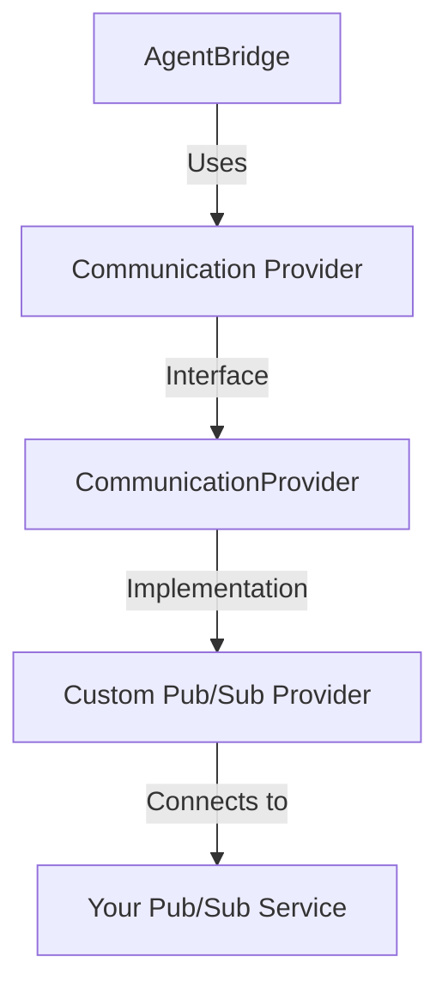

# Creating Custom Pub/Sub Providers

This guide explains how to create a custom Pub/Sub provider for AgentBridge if the built-in providers don't meet your needs.

## Overview

AgentBridge supports several Pub/Sub providers out of the box (Ably, Firebase, Pusher, Supabase), but you might need to integrate with a different messaging service. By implementing the `CommunicationProvider` interface, you can create a custom provider for any Pub/Sub service.



## Requirements

To create a custom Pub/Sub provider, you need:

1. A messaging service that supports real-time publish/subscribe
2. Client library for your chosen messaging service
3. Implementation of the `CommunicationProvider` interface

## Implementation Steps

### 1. Create a new provider class

Create a new class that implements the `CommunicationProvider` interface:

```typescript
import { CommunicationProvider, Message } from '@agentbridge/core';

export interface CustomProviderOptions {
  // Define your provider-specific options
  apiKey: string;
  endpoint?: string;
  clientOptions?: any;
}

export class CustomPubSubProvider implements CommunicationProvider {
  private client: any; // Your messaging service client
  private options: CustomProviderOptions;
  private messageCallback: ((message: Message) => void) | null = null;
  private statusCallback: ((status: string) => void) | null = null;
  private channelPrefix: string;
  private applicationId: string;
  private environmentId: string;
  
  constructor(options: CustomProviderOptions) {
    this.options = options;
    this.channelPrefix = options.channelPrefix || 'agentbridge';
  }
  
  // Initialize the provider with AgentBridge configuration
  public initialize(config: { applicationId: string; environmentId: string }) {
    this.applicationId = config.applicationId;
    this.environmentId = config.environmentId;
  }
  
  // Connect to the messaging service
  public async connect(): Promise<void> {
    if (this.statusCallback) {
      this.statusCallback('connecting');
    }
    
    try {
      // Initialize your messaging client
      this.client = new YourMessagingClient({
        apiKey: this.options.apiKey,
        // Other client-specific options
        ...this.options.clientOptions
      });
      
      // Connect to the service
      await this.client.connect();
      
      // Subscribe to channels
      await this.subscribeToChannels();
      
      if (this.statusCallback) {
        this.statusCallback('connected');
      }
    } catch (error) {
      if (this.statusCallback) {
        this.statusCallback('error');
      }
      throw error;
    }
  }
  
  // Disconnect from the messaging service
  public async disconnect(): Promise<void> {
    if (!this.client) return;
    
    try {
      // Unsubscribe from channels
      await this.unsubscribeFromChannels();
      
      // Disconnect client
      await this.client.disconnect();
      
      if (this.statusCallback) {
        this.statusCallback('disconnected');
      }
    } catch (error) {
      console.error('Error disconnecting from messaging service:', error);
    }
  }
  
  // Send a message to the appropriate channel
  public async sendMessage(message: Message): Promise<void> {
    if (!this.client) {
      throw new Error('Provider not connected');
    }
    
    const channelName = this.getChannelForMessageType(message.type);
    
    try {
      await this.client.publish(channelName, JSON.stringify(message));
    } catch (error) {
      console.error(`Error sending message to ${channelName}:`, error);
      throw error;
    }
  }
  
  // Register a callback for incoming messages
  public onMessage(callback: (message: Message) => void): void {
    this.messageCallback = callback;
  }
  
  // Register a callback for connection status changes
  public onConnectionStatusChange(callback: (status: string) => void): void {
    this.statusCallback = callback;
  }
  
  // Helper methods
  private getChannelForMessageType(type: string): string {
    const base = `${this.channelPrefix}-${this.applicationId}-${this.environmentId}`;
    
    switch (type) {
      case 'capability':
        return `${base}-capabilities`;
      case 'command':
        return `${base}-commands`;
      case 'response':
        return `${base}-responses`;
      case 'event':
        return `${base}-events`;
      default:
        return `${base}-messages`;
    }
  }
  
  private async subscribeToChannels(): Promise<void> {
    // Subscribe to all required channels
    const channels = [
      this.getChannelForMessageType('capability'),
      this.getChannelForMessageType('command'),
      this.getChannelForMessageType('response'),
      this.getChannelForMessageType('event')
    ];
    
    for (const channelName of channels) {
      const channel = this.client.channel(channelName);
      
      // Set up message handler
      channel.subscribe((rawMessage: any) => {
        try {
          const message = JSON.parse(rawMessage);
          
          if (this.messageCallback) {
            this.messageCallback(message);
          }
        } catch (error) {
          console.error('Error parsing message:', error);
        }
      });
    }
  }
  
  private async unsubscribeFromChannels(): Promise<void> {
    // Implementation depends on your messaging service
    // Unsubscribe from all channels
    const channels = [
      this.getChannelForMessageType('capability'),
      this.getChannelForMessageType('command'),
      this.getChannelForMessageType('response'),
      this.getChannelForMessageType('event')
    ];
    
    for (const channelName of channels) {
      const channel = this.client.channel(channelName);
      await channel.unsubscribe();
    }
  }
}
```

### 2. Adapt to your specific messaging service

You'll need to replace the placeholders with actual implementation for your chosen messaging service:

- Replace `YourMessagingClient` with the actual client class
- Implement channel subscription based on your service's API
- Implement message publishing based on your service's API
- Handle reconnection logic if necessary

### 3. Using your custom provider

Once implemented, you can use your custom provider with AgentBridge:

```javascript
import { AgentBridge } from '@agentbridge/core';
import { CustomPubSubProvider } from './custom-pubsub-provider';

// Create your custom provider
const customProvider = new CustomPubSubProvider({
  apiKey: 'your-api-key',
  endpoint: 'https://your-messaging-service.com',
  clientOptions: {
    // Additional options for your client
  }
});

// Initialize AgentBridge with your provider
const bridge = new AgentBridge({
  applicationId: 'my-app-123',
  environmentId: 'development'
});

bridge.initialize(customProvider);
```

## Example: MQTT Provider

Here's a more concrete example implementing a provider for MQTT:

```typescript
import { CommunicationProvider, Message } from '@agentbridge/core';
import * as mqtt from 'mqtt';

export interface MqttProviderOptions {
  url: string;
  clientId?: string;
  username?: string;
  password?: string;
  channelPrefix?: string;
}

export class MqttProvider implements CommunicationProvider {
  private client: mqtt.Client | null = null;
  private options: MqttProviderOptions;
  private messageCallback: ((message: Message) => void) | null = null;
  private statusCallback: ((status: string) => void) | null = null;
  private channelPrefix: string;
  private applicationId: string = '';
  private environmentId: string = '';
  
  constructor(options: MqttProviderOptions) {
    this.options = options;
    this.channelPrefix = options.channelPrefix || 'agentbridge';
  }
  
  public initialize(config: { applicationId: string; environmentId: string }) {
    this.applicationId = config.applicationId;
    this.environmentId = config.environmentId;
  }
  
  public async connect(): Promise<void> {
    if (this.statusCallback) {
      this.statusCallback('connecting');
    }
    
    return new Promise((resolve, reject) => {
      try {
        // Create MQTT client
        this.client = mqtt.connect(this.options.url, {
          clientId: this.options.clientId || `agentbridge-${Math.random().toString(16).substr(2, 8)}`,
          username: this.options.username,
          password: this.options.password,
          keepalive: 60,
          reconnectPeriod: 1000
        });
        
        // Handle connection events
        this.client.on('connect', () => {
          this.subscribeToChannels().then(() => {
            if (this.statusCallback) {
              this.statusCallback('connected');
            }
            resolve();
          });
        });
        
        this.client.on('error', (err) => {
          console.error('MQTT connection error:', err);
          if (this.statusCallback) {
            this.statusCallback('error');
          }
          reject(err);
        });
        
        this.client.on('message', (topic, message) => {
          try {
            const parsedMessage = JSON.parse(message.toString());
            
            if (this.messageCallback) {
              this.messageCallback(parsedMessage);
            }
          } catch (error) {
            console.error('Error parsing message:', error);
          }
        });
        
        this.client.on('disconnect', () => {
          if (this.statusCallback) {
            this.statusCallback('disconnected');
          }
        });
        
        this.client.on('reconnect', () => {
          if (this.statusCallback) {
            this.statusCallback('reconnecting');
          }
        });
      } catch (error) {
        if (this.statusCallback) {
          this.statusCallback('error');
        }
        reject(error);
      }
    });
  }
  
  public async disconnect(): Promise<void> {
    return new Promise((resolve) => {
      if (!this.client) {
        resolve();
        return;
      }
      
      this.client.end(true, {}, () => {
        this.client = null;
        if (this.statusCallback) {
          this.statusCallback('disconnected');
        }
        resolve();
      });
    });
  }
  
  public async sendMessage(message: Message): Promise<void> {
    if (!this.client) {
      throw new Error('MQTT client not connected');
    }
    
    const topic = this.getTopicForMessageType(message.type);
    
    return new Promise((resolve, reject) => {
      this.client!.publish(
        topic, 
        JSON.stringify(message), 
        { qos: 1 }, 
        (error) => {
          if (error) {
            reject(error);
          } else {
            resolve();
          }
        }
      );
    });
  }
  
  public onMessage(callback: (message: Message) => void): void {
    this.messageCallback = callback;
  }
  
  public onConnectionStatusChange(callback: (status: string) => void): void {
    this.statusCallback = callback;
  }
  
  private getTopicForMessageType(type: string): string {
    const base = `${this.channelPrefix}/${this.applicationId}/${this.environmentId}`;
    
    switch (type) {
      case 'capability':
        return `${base}/capabilities`;
      case 'command':
        return `${base}/commands`;
      case 'response':
        return `${base}/responses`;
      case 'event':
        return `${base}/events`;
      default:
        return `${base}/messages`;
    }
  }
  
  private async subscribeToChannels(): Promise<void> {
    if (!this.client) {
      throw new Error('MQTT client not connected');
    }
    
    const topics = [
      this.getTopicForMessageType('capability'),
      this.getTopicForMessageType('command'),
      this.getTopicForMessageType('response'),
      this.getTopicForMessageType('event')
    ];
    
    return new Promise((resolve, reject) => {
      this.client!.subscribe(topics, { qos: 1 }, (err) => {
        if (err) {
          reject(err);
        } else {
          resolve();
        }
      });
    });
  }
}
```

## Best Practices

When creating a custom Pub/Sub provider:

1. **Reconnection Logic**: Implement robust reconnection logic to handle network interruptions
2. **Error Handling**: Provide clear error messages and graceful error handling
3. **Message Serialization**: Ensure proper serialization/deserialization of messages
4. **Channel Security**: Implement appropriate authentication and authorization for channels
5. **Testing**: Thoroughly test edge cases and failure scenarios

## Debugging

To debug your custom provider, you can add logging:

```typescript
public async sendMessage(message: Message): Promise<void> {
  console.log(`Sending message to ${this.getChannelForMessageType(message.type)}:`, message);
  
  // Implementation
  // ...
  
  console.log('Message sent successfully');
}
```

## Security Considerations

When implementing a custom provider:

1. **API Key Security**: Store API keys securely (environment variables, etc.)
2. **Transport Security**: Use secure connections (TLS/SSL)
3. **Authentication**: Implement authentication mechanisms
4. **Authorization**: Control access to channels
5. **Message Validation**: Validate message formats

For more comprehensive security guidance, see the [Security Best Practices](security.md) documentation.

## Next Steps

- [Pub/Sub Configuration](../core/pubsub-config.md): Learn about configuring Pub/Sub providers
- [Communication Protocol](../core/communication-protocol.md): Understand the message format
- [AgentBridge API Reference](../core/api-reference.md): Core API documentation 