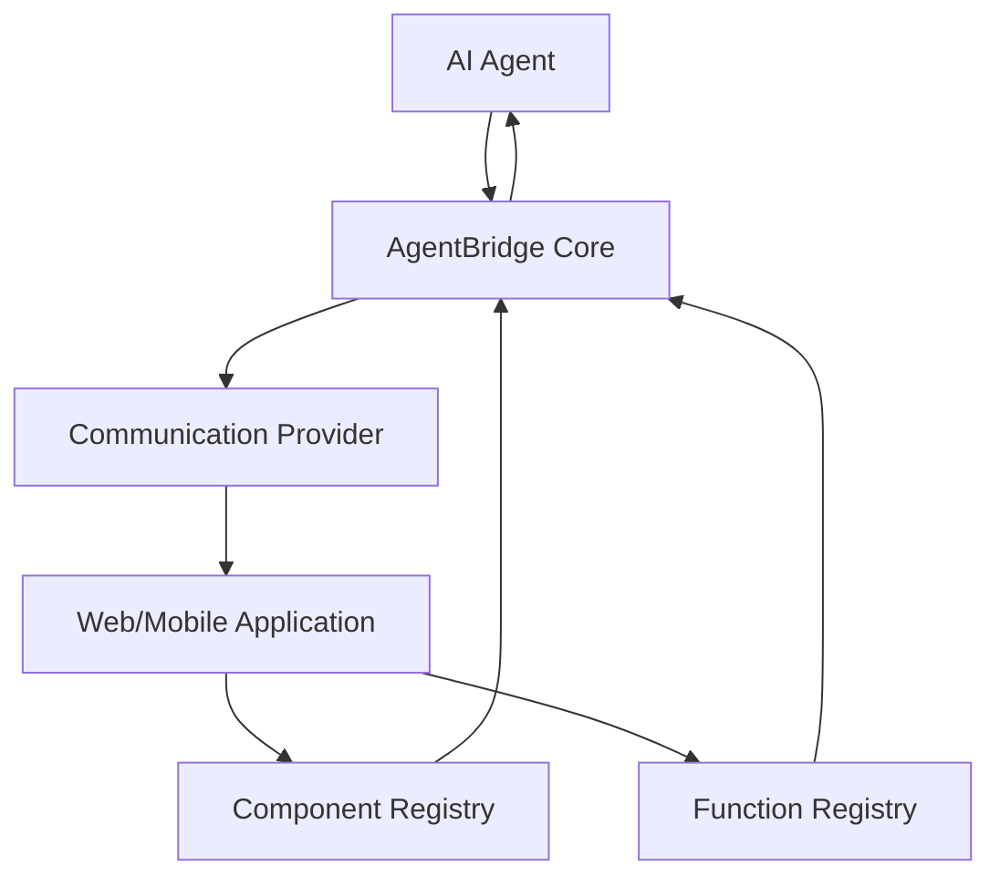
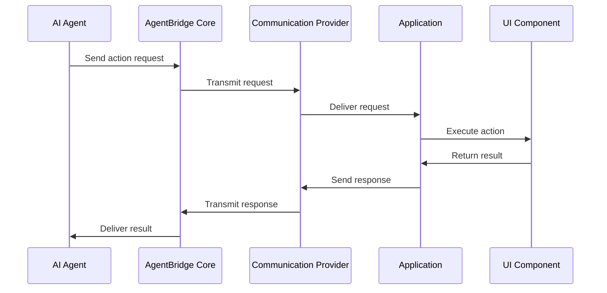
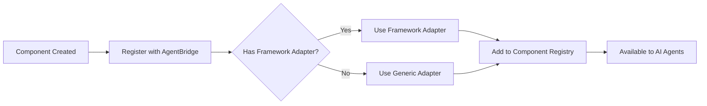
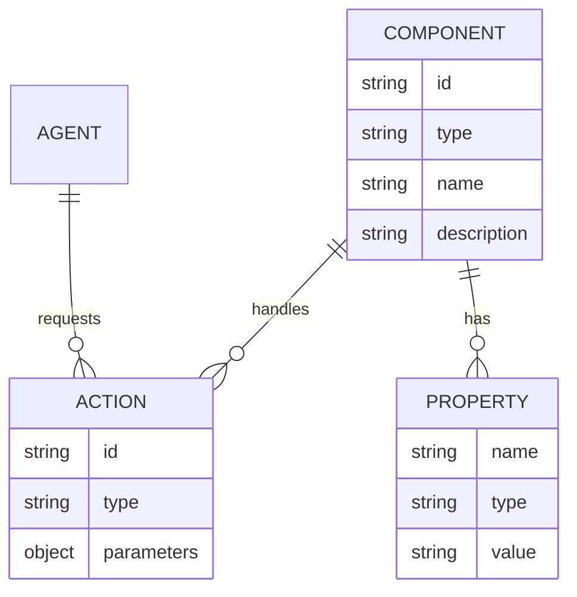

# Design Information Collection

This guide explains how to collect and use UI design information to enhance AI agent understanding of your application's interface.

## Overview

Design information collection is a key feature that helps AI agents understand the structure, layout, and purpose of your UI components. This information enables more contextual and effective interactions.

## Setting Up Design Collectors

AgentBridge provides platform-specific design collectors that analyze your UI and extract relevant information.

### JavaScript/TypeScript (React)

```typescript
import { AgentBridge } from '@agentbridge/core';
import { ReactDesignCollector } from '@agentbridge/react';

const agentBridge = new AgentBridge();
const designCollector = new ReactDesignCollector();

// In your root component
function App() {
  useEffect(() => {
    // Capture component tree after initial render
    const designInfo = designCollector.captureDesignInfo();
    
    // Register design information with AgentBridge
    agentBridge.registerDesignInfo(designInfo);
    
    // Optionally set up automatic updates
    const unsubscribe = designCollector.startAutoCapture({
      interval: 5000, // milliseconds
      onChange: (newDesignInfo) => {
        agentBridge.registerDesignInfo(newDesignInfo);
      }
    });
    
    return () => {
      if (unsubscribe) unsubscribe();
    };
  }, []);
  
  // ...
}
```

### Flutter

```dart
import 'package:agentbridge/agentbridge.dart';

class MyApp extends StatefulWidget {
  @override
  _MyAppState createState() => _MyAppState();
}

class _MyAppState extends State<MyApp> {
  final designCollector = FlutterDesignCollector();
  Timer? _captureTimer;
  
  @override
  void initState() {
    super.initState();
    
    // Capture after first frame
    WidgetsBinding.instance.addPostFrameCallback((_) {
      _captureDesignInfo();
    });
    
    // Set up periodic capture
    _captureTimer = Timer.periodic(Duration(seconds: 5), (_) {
      _captureDesignInfo();
    });
  }
  
  void _captureDesignInfo() {
    final designInfo = designCollector.captureDesignInfo(context);
    AgentBridge.instance.registerDesignInfo(designInfo);
  }
  
  @override
  void dispose() {
    _captureTimer?.cancel();
    super.dispose();
  }
  
  @override
  Widget build(BuildContext context) {
    // ...
  }
}
```

## Design Information Structure

The collected design information includes:

```json
{
  "appInfo": {
    "name": "MyApp",
    "version": "1.0.0",
    "theme": "light",
    "platform": "web",
    "screenSize": {
      "width": 1024,
      "height": 768
    }
  },
  "screens": [
    {
      "id": "home-screen",
      "name": "Home",
      "route": "/home",
      "active": true,
      "components": [
        {
          "id": "header",
          "type": "container",
          "position": {
            "x": 0,
            "y": 0,
            "width": 1024,
            "height": 80
          },
          "children": ["logo", "nav-menu"]
        },
        // ... more components
      ]
    }
  ],
  "navigationState": {
    "currentRoute": "/home",
    "availableRoutes": ["/home", "/products", "/about", "/contact"],
    "history": ["/", "/home"]
  },
  "componentTree": {
    // Hierarchical component structure
  }
}
```

## Customizing Design Collection

You can customize what information is collected:

```typescript
// JavaScript/TypeScript
const designCollector = new ReactDesignCollector({
  captureOptions: {
    includeStyles: true,
    includeDisabledComponents: true,
    includeHiddenComponents: false,
    includePositions: true,
    maxDepth: 10,
    captureScreenshots: false,
  }
});
```

```dart
// Flutter
final designCollector = FlutterDesignCollector(
  captureOptions: CaptureOptions(
    includeStyles: true,
    includeDisabledComponents: true,
    includeHiddenComponents: false,
    includePositions: true,
    maxDepth: 10,
    captureScreenshots: false,
  ),
);
```

## Manual Design Information

You can also manually provide design information:

```typescript
// JavaScript/TypeScript
agentBridge.registerDesignInfo({
  appInfo: {
    name: "TodoApp",
    theme: "light"
  },
  screens: [
    {
      id: "tasks-screen",
      name: "Tasks",
      active: true,
      components: [
        // ...component details
      ]
    }
  ],
  // ... other design info
});
```

## Using Design Information with AI Agents

Design information is automatically made available to AI agents through registered functions:

```typescript
// Register function to get design information
agentBridge.registerFunction({
  name: 'getUIDesign',
  description: 'Get information about the UI design and layout',
  parameters: {
    type: 'object',
    properties: {
      includeDetails: {
        type: 'boolean',
        description: 'Whether to include detailed styling information'
      }
    }
  },
  handler: async (params) => {
    const designInfo = agentBridge.getDesignInfo();
    
    if (!params.includeDetails) {
      // Simplify the response by removing detailed styling
      return simplifyDesignInfo(designInfo);
    }
    
    return designInfo;
  }
});
```

## Design Information for Navigation

Design information can help AI agents understand navigation options:

```typescript
// Register navigation-related function
agentBridge.registerFunction({
  name: 'navigateTo',
  description: 'Navigate to a different screen or view',
  parameters: {
    type: 'object',
    properties: {
      route: {
        type: 'string',
        description: 'The route to navigate to'
      }
    },
    required: ['route']
  },
  handler: async (params) => {
    const designInfo = agentBridge.getDesignInfo();
    const availableRoutes = designInfo.navigationState.availableRoutes;
    
    if (!availableRoutes.includes(params.route)) {
      return {
        success: false,
        error: {
          message: `Route "${params.route}" not available. Available routes: ${availableRoutes.join(', ')}`
        }
      };
    }
    
    // Perform navigation
    navigator.navigate(params.route);
    
    return {
      success: true,
      currentRoute: params.route
    };
  }
});
```

## Performance Considerations

Design information collection can be resource-intensive. Consider these best practices:

1. **Throttle Collection**: Don't collect information too frequently
2. **Limit Depth**: Set a reasonable `maxDepth` to avoid capturing too much detail
3. **Selective Capture**: Only capture what's needed for AI understanding
4. **Batch Updates**: Update design information in batches rather than on every small UI change

```typescript
// Example of throttled collection
let throttleTimeout = null;
function throttledDesignCapture() {
  if (throttleTimeout) return;
  
  throttleTimeout = setTimeout(() => {
    const designInfo = designCollector.captureDesignInfo();
    agentBridge.registerDesignInfo(designInfo);
    throttleTimeout = null;
  }, 500);
}

// Call on significant UI changes
window.addEventListener('resize', throttledDesignCapture);
```

## Debugging Design Information

AgentBridge provides utilities to help debug design information:

```typescript
// JavaScript/TypeScript
// Enable debug mode
designCollector.setDebugMode(true);

// Log design information
console.log(JSON.stringify(agentBridge.getDesignInfo(), null, 2));

// Visualize component boundaries
designCollector.visualizeComponents();
```

```dart
// Flutter
// Enable debug mode
designCollector.setDebugMode(true);

// Log design information
print(jsonEncode(AgentBridge.instance.getDesignInfo()));

// Visualize component boundaries in debug mode
designCollector.visualizeComponents(context);
```

## Related Guides

For more information about component registration and advanced MCP usage, see:
- [Component Registration](component-registration.md)
- [Advanced MCP Usage](mcp-advanced.md)

# Design Information

This page contains detailed design information about the AgentBridge architecture, including component relationships and communication flows.

## Component Architecture

The following diagram illustrates the high-level architecture of AgentBridge:



## Communication Flow

The sequence of events when an AI agent interacts with an application component:



## Component Registration Process



## Data Model

