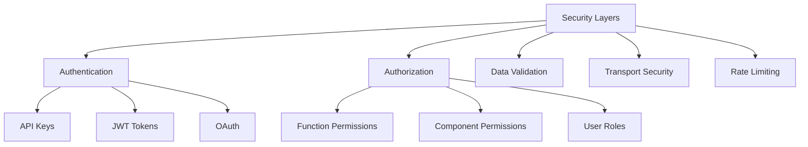
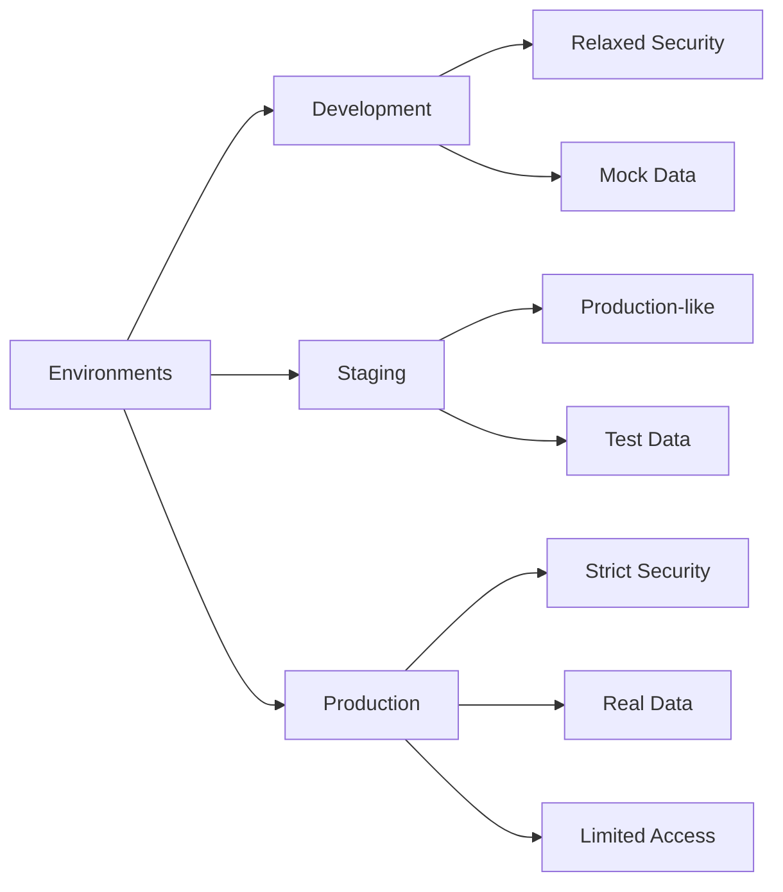

# Security Best Practices

This guide outlines security best practices for implementing and using AgentBridge in your applications.

## Overview

When integrating AI agents with your applications, security is a critical consideration. AgentBridge provides several security features to help protect your application and users, but proper implementation is essential.



## Authentication

Proper authentication ensures that only authorized AI agents can connect to your application.

### API Keys

When using pub/sub providers, secure your API keys:

- Rotate API keys regularly
- Use environment variables to store keys
- Never commit API keys to version control
- Use separate keys for development and production

```javascript
// Good: Load from environment variables
const provider = new AblyProvider({
  apiKey: process.env.ABLY_API_KEY
});

// Bad: Hardcoded keys
const provider = new AblyProvider({
  apiKey: "abc123XYZ" // Never do this
});
```

### JWT Authentication

For self-hosted mode, use JWT tokens for authentication:

```javascript
// Generate a JWT token on your server
const token = jwt.sign(
  { 
    agentId: "agent-123",
    permissions: ["read:components", "execute:functions"] 
  },
  process.env.JWT_SECRET,
  { expiresIn: "1h" }
);

// Configure WebSocket provider with JWT
const wsProvider = new WebSocketProvider({
  url: "wss://your-server.com/agent-bridge",
  headers: {
    Authorization: `Bearer ${token}`
  }
});
```

## Authorization

Implement proper authorization to control what actions agents can perform.

### Function Permissions

Restrict access to sensitive functions:

```javascript
bridge.registerFunction({
  name: "getUserData",
  description: "Get user data",
  permissions: ["admin:read"], // Require specific permissions
  handler: async () => {
    // Implementation
  }
});
```

### Component Permissions

Restrict access to UI components:

```javascript
bridge.registerComponent("admin-panel", {
  // Component definition
  permissions: ["admin:access"]
}, {
  // Component handlers
});
```

## Data Validation

Always validate all data exchanged with AI agents.

### Input Validation

Validate function parameters using the type system:

```javascript
bridge.registerFunction({
  name: "transferFunds",
  description: "Transfer funds between accounts",
  parameters: {
    type: "object",
    properties: {
      fromAccount: { type: "string", pattern: "^[0-9]{10}$" },
      toAccount: { type: "string", pattern: "^[0-9]{10}$" },
      amount: { type: "number", minimum: 0.01 }
    },
    required: ["fromAccount", "toAccount", "amount"]
  },
  handler: async (params) => {
    // Implementation with validated parameters
  }
});
```

### Output Validation

Validate data before sending it to agents:

```javascript
// Before sending sensitive data, validate and sanitize
function sanitizeUserData(userData) {
  return {
    name: userData.name,
    email: userData.email,
    // Remove sensitive fields
    // No password, SSN, etc.
  };
}
```

## Transport Security

Ensure secure communication channels between components.

### WebSocket Security

For self-hosted mode:

- Always use WSS (WebSocket Secure) instead of WS
- Implement proper TLS certificate management
- Enable HTTP strict transport security (HSTS)

### Pub/Sub Security

For pub/sub providers:

- Use providers that support end-to-end encryption
- Implement channel-specific authentication
- Use private channels when possible

## Rate Limiting

Protect against abuse with rate limiting.

### Function Rate Limiting

```javascript
// Implement rate limiting for sensitive functions
let callCounter = {};

bridge.registerFunction({
  name: "sensitiveOperation",
  description: "Performs a sensitive operation",
  handler: async (params) => {
    const agentId = context.agentId;
    
    // Initialize counter if needed
    callCounter[agentId] = callCounter[agentId] || {
      count: 0,
      resetTime: Date.now() + 3600000 // 1 hour
    };
    
    // Check if rate limit exceeded
    if (callCounter[agentId].count >= 10) {
      throw new Error("Rate limit exceeded. Try again later.");
    }
    
    // Increment counter
    callCounter[agentId].count++;
    
    // Reset counter if needed
    if (Date.now() > callCounter[agentId].resetTime) {
      callCounter[agentId] = {
        count: 1,
        resetTime: Date.now() + 3600000
      };
    }
    
    // Function implementation
  }
});
```

## Environment Isolation

Maintain separate environments with different security configurations.



## Audit Logging

Implement comprehensive logging for security events.

```javascript
// Log all function calls for audit purposes
bridge.on("functionCall", (event) => {
  logger.info(`Function call: ${event.functionName}`, {
    agentId: event.agentId,
    timestamp: event.timestamp,
    parameters: event.parameters,
    success: event.success,
    errorMessage: event.error?.message
  });
});
```

## Security Checklist

Use this checklist to ensure you've addressed key security concerns:

- [ ] API keys and secrets are stored securely
- [ ] Authentication is implemented for all communication
- [ ] Authorization controls are in place for sensitive functions
- [ ] All input data is validated using schema validation
- [ ] Transport security is configured (WSS or encrypted pub/sub)
- [ ] Rate limiting is implemented for sensitive operations
- [ ] Environment isolation is maintained (dev/staging/prod)
- [ ] Audit logging is in place for security events
- [ ] Error messages don't leak sensitive information
- [ ] Regular security reviews are scheduled

## Related Documentation

- [Communication Protocol](../core/communication-protocol.md): Details on message security
- [Type System](../core/type-system.md): Information on input validation 