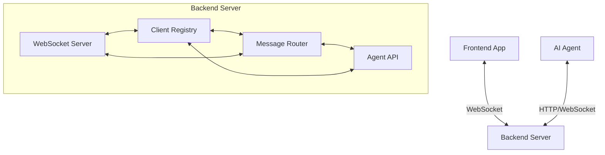
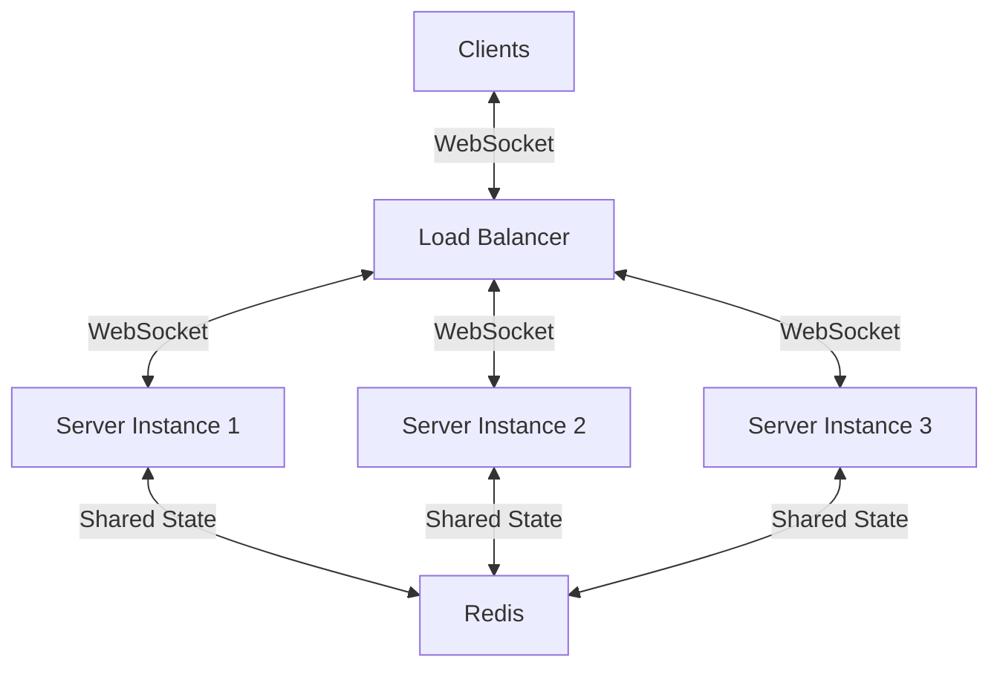

# Server Implementations Guide

This guide provides examples and best practices for implementing an AgentBridge server in various backend frameworks. These implementations are for the self-hosted communication mode.

## Architecture Overview

A self-hosted AgentBridge server consists of:

1. **WebSocket Server**: Handles WebSocket connections from frontend applications
2. **Agent API**: REST or WebSocket API for AI agents to communicate with the server
3. **Client Registry**: Tracks connected clients and their capabilities
4. **Message Router**: Routes messages between AI agents and frontend applications



## Node.js Implementation

### Express with ws

This example uses the Express framework with the 'ws' library:

```javascript
const express = require('express');
const http = require('http');
const WebSocket = require('ws');
const { v4: uuidv4 } = require('uuid');
const cors = require('cors');
const bodyParser = require('body-parser');

// Create Express app and HTTP server
const app = express();
const server = http.createServer(app);

// Enable CORS and JSON parsing
app.use(cors());
app.use(bodyParser.json());

// Create WebSocket server
const wss = new WebSocket.Server({ server });

// Client registry
const clients = new Map();
const capabilities = new Map();

// WebSocket connection handler
wss.on('connection', (ws, req) => {
  // Generate unique client ID
  const clientId = uuidv4();
  
  console.log(`Client connected: ${clientId}`);
  
  // Store client in registry
  clients.set(clientId, {
    ws,
    capabilities: [],
    lastSeen: Date.now()
  });
  
  // Send client ID to the client
  ws.send(JSON.stringify({
    type: 'connection',
    clientId
  }));
  
  // Handle messages from client
  ws.on('message', (message) => {
    try {
      const parsedMessage = JSON.parse(message);
      
      // Handle different message types
      switch (parsedMessage.type) {
        case 'capability':
          // Store client capabilities
          clients.get(clientId).capabilities = parsedMessage.capabilities;
          capabilities.set(clientId, parsedMessage.capabilities);
          console.log(`Received capabilities from ${clientId}`);
          break;
          
        case 'response':
          // Forward response to AI agent
          // In a real implementation, you'd use a request/response correlation system
          console.log(`Received response from ${clientId}`);
          break;
          
        case 'event':
          // Handle events (could be broadcast to interested agents)
          console.log(`Received event from ${clientId}`);
          break;
          
        default:
          console.warn(`Unknown message type: ${parsedMessage.type}`);
      }
    } catch (err) {
      console.error('Error handling message:', err);
    }
  });
  
  // Handle disconnection
  ws.on('close', () => {
    console.log(`Client disconnected: ${clientId}`);
    clients.delete(clientId);
    capabilities.delete(clientId);
  });
});

// Agent API endpoints
app.get('/api/capabilities', (req, res) => {
  // Return all capabilities from all clients
  const allCapabilities = {};
  
  for (const [clientId, clientCapabilities] of capabilities.entries()) {
    allCapabilities[clientId] = clientCapabilities;
  }
  
  res.json(allCapabilities);
});

app.post('/api/command', (req, res) => {
  const { clientId, command } = req.body;
  
  // Check if client exists
  if (!clients.has(clientId)) {
    return res.status(404).json({
      error: 'Client not found'
    });
  }
  
  const client = clients.get(clientId);
  
  // Send command to client
  try {
    client.ws.send(JSON.stringify({
      type: 'command',
      ...command
    }));
    
    // In a real implementation, you would:
    // 1. Generate a requestId
    // 2. Store the request in a pending requests map
    // 3. Set up a timeout for the request
    // 4. Return the response when received or timeout
    
    // For this simple example, we just acknowledge receipt
    res.json({
      success: true,
      message: 'Command sent to client'
    });
  } catch (err) {
    res.status(500).json({
      error: 'Failed to send command',
      message: err.message
    });
  }
});

// Start server
const PORT = process.env.PORT || 3001;
server.listen(PORT, () => {
  console.log(`Server running on port ${PORT}`);
});
```

### NestJS Implementation

For NestJS, you can use the built-in WebSocket support:

```typescript
// websocket.gateway.ts
import {
  WebSocketGateway,
  WebSocketServer,
  SubscribeMessage,
  OnGatewayConnection,
  OnGatewayDisconnect
} from '@nestjs/websockets';
import { Server, Socket } from 'socket.io';
import { v4 as uuidv4 } from 'uuid';

@WebSocketGateway()
export class AgentBridgeGateway implements OnGatewayConnection, OnGatewayDisconnect {
  @WebSocketServer()
  server: Server;
  
  private clients = new Map();
  private capabilities = new Map();
  
  handleConnection(client: Socket) {
    const clientId = uuidv4();
    console.log(`Client connected: ${clientId}`);
    
    this.clients.set(clientId, {
      client,
      capabilities: [],
      lastSeen: Date.now()
    });
    
    client.emit('connection', { clientId });
  }
  
  handleDisconnect(client: Socket) {
    // Find clientId for this socket
    let disconnectedClientId: string | null = null;
    
    for (const [clientId, data] of this.clients.entries()) {
      if (data.client === client) {
        disconnectedClientId = clientId;
        break;
      }
    }
    
    if (disconnectedClientId) {
      console.log(`Client disconnected: ${disconnectedClientId}`);
      this.clients.delete(disconnectedClientId);
      this.capabilities.delete(disconnectedClientId);
    }
  }
  
  @SubscribeMessage('capability')
  handleCapability(client: Socket, payload: any) {
    // Find clientId for this socket
    let targetClientId: string | null = null;
    
    for (const [clientId, data] of this.clients.entries()) {
      if (data.client === client) {
        targetClientId = clientId;
        break;
      }
    }
    
    if (targetClientId) {
      this.clients.get(targetClientId).capabilities = payload.capabilities;
      this.capabilities.set(targetClientId, payload.capabilities);
      console.log(`Received capabilities from ${targetClientId}`);
    }
  }
  
  // Additional message handlers
  
  // Method to send a command to a client
  sendCommand(clientId: string, command: any) {
    if (!this.clients.has(clientId)) {
      throw new Error('Client not found');
    }
    
    const client = this.clients.get(clientId);
    client.client.emit('command', command);
  }
  
  // Method to get all capabilities
  getAllCapabilities() {
    const allCapabilities = {};
    
    for (const [clientId, clientCapabilities] of this.capabilities.entries()) {
      allCapabilities[clientId] = clientCapabilities;
    }
    
    return allCapabilities;
  }
}

// agent.controller.ts
import { Controller, Get, Post, Body, HttpException, HttpStatus } from '@nestjs/common';
import { AgentBridgeGateway } from './websocket.gateway';

@Controller('api')
export class AgentController {
  constructor(private readonly gateway: AgentBridgeGateway) {}
  
  @Get('capabilities')
  getCapabilities() {
    return this.gateway.getAllCapabilities();
  }
  
  @Post('command')
  sendCommand(@Body() body: { clientId: string; command: any }) {
    const { clientId, command } = body;
    
    try {
      this.gateway.sendCommand(clientId, command);
      return { success: true, message: 'Command sent to client' };
    } catch (err) {
      throw new HttpException({
        error: 'Failed to send command',
        message: err.message
      }, HttpStatus.INTERNAL_SERVER_ERROR);
    }
  }
}
```

## Python Implementation

### FastAPI with websockets

FastAPI provides excellent WebSocket support:

```python
from fastapi import FastAPI, WebSocket, WebSocketDisconnect, HTTPException
from fastapi.middleware.cors import CORSMiddleware
from pydantic import BaseModel
import json
import uuid
import asyncio
from typing import Dict, List, Any

app = FastAPI()

# Enable CORS
app.add_middleware(
    CORSMiddleware,
    allow_origins=["*"],
    allow_credentials=True,
    allow_methods=["*"],
    allow_headers=["*"],
)

# Client registry
clients = {}
capabilities = {}

# Command models
class Command(BaseModel):
    target: str
    action: str
    parameters: Dict[str, Any] = {}

class CommandRequest(BaseModel):
    clientId: str
    command: Command

@app.websocket("/ws")
async def websocket_endpoint(websocket: WebSocket):
    await websocket.accept()
    
    # Generate client ID
    client_id = str(uuid.uuid4())
    
    # Store client
    clients[client_id] = {
        "websocket": websocket,
        "capabilities": [],
        "last_seen": asyncio.get_event_loop().time()
    }
    
    # Send client ID to the client
    await websocket.send_text(json.dumps({
        "type": "connection",
        "clientId": client_id
    }))
    
    try:
        while True:
            # Receive message from client
            message_text = await websocket.receive_text()
            message = json.loads(message_text)
            
            # Handle different message types
            if message.get("type") == "capability":
                # Store client capabilities
                clients[client_id]["capabilities"] = message.get("capabilities", [])
                capabilities[client_id] = message.get("capabilities", [])
                print(f"Received capabilities from {client_id}")
            
            elif message.get("type") == "response":
                # Forward response to AI agent
                # In a real implementation, you'd use a request/response correlation system
                print(f"Received response from {client_id}")
            
            elif message.get("type") == "event":
                # Handle events (could be broadcast to interested agents)
                print(f"Received event from {client_id}")
            
            else:
                print(f"Unknown message type: {message.get('type')}")
    
    except WebSocketDisconnect:
        # Remove client on disconnect
        print(f"Client disconnected: {client_id}")
        if client_id in clients:
            del clients[client_id]
        if client_id in capabilities:
            del capabilities[client_id]

@app.get("/api/capabilities")
async def get_capabilities():
    # Return all capabilities from all clients
    return capabilities

@app.post("/api/command")
async def send_command(request: CommandRequest):
    client_id = request.clientId
    command = request.command
    
    # Check if client exists
    if client_id not in clients:
        raise HTTPException(status_code=404, detail="Client not found")
    
    client = clients[client_id]
    
    try:
        # Send command to client
        await client["websocket"].send_text(json.dumps({
            "type": "command",
            "target": command.target,
            "action": command.action,
            "parameters": command.parameters
        }))
        
        # For this simple example, we just acknowledge receipt
        return {
            "success": True,
            "message": "Command sent to client"
        }
    except Exception as e:
        raise HTTPException(
            status_code=500,
            detail=f"Failed to send command: {str(e)}"
        )
```

## Ruby Implementation

### Ruby on Rails with ActionCable

Rails provides ActionCable for WebSocket support:

```ruby
# app/channels/agent_bridge_channel.rb
class AgentBridgeChannel < ApplicationCable::Channel
  def subscribed
    # Generate client ID
    @client_id = SecureRandom.uuid
    
    # Store client in registry
    CLIENTS[@client_id] = {
      connection: self,
      capabilities: [],
      last_seen: Time.now
    }
    
    # Send client ID to the client
    transmit(type: 'connection', clientId: @client_id)
    
    stream_from "agent_bridge_#{@client_id}"
  end
  
  def unsubscribed
    # Remove client from registry
    Rails.logger.info "Client disconnected: #{@client_id}"
    CLIENTS.delete(@client_id)
    CAPABILITIES.delete(@client_id)
  end
  
  def receive(data)
    data = data.with_indifferent_access
    
    case data[:type]
    when 'capability'
      # Store client capabilities
      CLIENTS[@client_id][:capabilities] = data[:capabilities]
      CAPABILITIES[@client_id] = data[:capabilities]
      Rails.logger.info "Received capabilities from #{@client_id}"
      
    when 'response'
      # Forward response to AI agent
      # In a real implementation, you'd use a request/response correlation system
      Rails.logger.info "Received response from #{@client_id}"
      
    when 'event'
      # Handle events (could be broadcast to interested agents)
      Rails.logger.info "Received event from #{@client_id}"
      
    else
      Rails.logger.warn "Unknown message type: #{data[:type]}"
    end
  end
end

# app/controllers/agent_controller.rb
class AgentController < ApplicationController
  def capabilities
    render json: CAPABILITIES
  end
  
  def command
    client_id = params[:clientId]
    command = params[:command]
    
    # Check if client exists
    unless CLIENTS.key?(client_id)
      return render json: { error: 'Client not found' }, status: 404
    end
    
    client = CLIENTS[client_id]
    
    begin
      # Send command to client
      ActionCable.server.broadcast "agent_bridge_#{client_id}", {
        type: 'command',
        target: command[:target],
        action: command[:action],
        parameters: command[:parameters] || {}
      }
      
      # For this simple example, we just acknowledge receipt
      render json: {
        success: true,
        message: 'Command sent to client'
      }
    rescue => e
      render json: {
        error: 'Failed to send command',
        message: e.message
      }, status: 500
    end
  end
end

# config/initializers/agent_bridge.rb
CLIENTS = {}
CAPABILITIES = {}
```

## Best Practices

### Authentication

Always implement authentication for both WebSocket connections and API endpoints:

```javascript
// Example JWT authentication middleware for Express
const jwt = require('jsonwebtoken');

function authenticateToken(req, res, next) {
  const authHeader = req.headers['authorization'];
  const token = authHeader && authHeader.split(' ')[1];
  
  if (!token) {
    return res.status(401).json({ error: 'Authentication required' });
  }
  
  jwt.verify(token, process.env.JWT_SECRET, (err, user) => {
    if (err) {
      return res.status(403).json({ error: 'Invalid or expired token' });
    }
    
    req.user = user;
    next();
  });
}

// Apply to routes
app.use('/api', authenticateToken);
```

### WebSocket Authentication

```javascript
// Authentication for WebSocket connections
wss.on('connection', (ws, req) => {
  // Extract token from query parameters or headers
  const url = new URL(req.url, `http://${req.headers.host}`);
  const token = url.searchParams.get('token');
  
  if (!token) {
    ws.close(4001, 'Authentication required');
    return;
  }
  
  try {
    // Verify token
    const user = jwt.verify(token, process.env.JWT_SECRET);
    
    // Store user info with connection
    ws.user = user;
    
    // Continue with normal connection handling
    // ...
  } catch (err) {
    ws.close(4003, 'Invalid token');
  }
});
```

### Connection Management

Implement proper connection management:

```javascript
// Heartbeat mechanism to detect dead connections
function heartbeat() {
  this.isAlive = true;
}

wss.on('connection', (ws) => {
  ws.isAlive = true;
  ws.on('pong', heartbeat);
  
  // ... other connection handling
});

// Check for dead connections every 30 seconds
const interval = setInterval(() => {
  wss.clients.forEach((ws) => {
    if (ws.isAlive === false) {
      return ws.terminate();
    }
    
    ws.isAlive = false;
    ws.ping();
  });
}, 30000);

wss.on('close', () => {
  clearInterval(interval);
});
```

### Request/Response Correlation

Implement a request/response correlation system for asynchronous communication:

```javascript
// Store pending requests
const pendingRequests = new Map();

// When sending a command
app.post('/api/command', (req, res) => {
  const { clientId, command } = req.body;
  
  // Check if client exists
  if (!clients.has(clientId)) {
    return res.status(404).json({ error: 'Client not found' });
  }
  
  const client = clients.get(clientId);
  const requestId = uuidv4();
  
  // Create a promise for this request
  const responsePromise = new Promise((resolve, reject) => {
    // Set a timeout for the request
    const timeout = setTimeout(() => {
      pendingRequests.delete(requestId);
      reject(new Error('Request timed out'));
    }, 30000); // 30 second timeout
    
    pendingRequests.set(requestId, { resolve, reject, timeout });
  });
  
  // Send command to client
  try {
    client.ws.send(JSON.stringify({
      type: 'command',
      requestId,
      ...command
    }));
    
    // Wait for response
    responsePromise
      .then(response => {
        res.json(response);
      })
      .catch(err => {
        res.status(500).json({
          error: 'Command failed',
          message: err.message
        });
      });
  } catch (err) {
    pendingRequests.delete(requestId);
    res.status(500).json({
      error: 'Failed to send command',
      message: err.message
    });
  }
});

// When receiving a response
ws.on('message', (message) => {
  try {
    const parsedMessage = JSON.parse(message);
    
    if (parsedMessage.type === 'response' && parsedMessage.requestId) {
      const pendingRequest = pendingRequests.get(parsedMessage.requestId);
      
      if (pendingRequest) {
        clearTimeout(pendingRequest.timeout);
        pendingRequests.delete(parsedMessage.requestId);
        
        if (parsedMessage.status === 'success') {
          pendingRequest.resolve(parsedMessage.result);
        } else {
          pendingRequest.reject(new Error(parsedMessage.error?.message || 'Command failed'));
        }
      }
    }
    
    // ... handle other message types
  } catch (err) {
    console.error('Error handling message:', err);
  }
});
```

## Scaling Considerations

### Load Balancing

When scaling to multiple server instances:



Use Redis or another shared store for client registry and pending requests:

```javascript
const Redis = require('ioredis');
const redis = new Redis(process.env.REDIS_URL);

// Store client information in Redis
async function registerClient(clientId, serverId) {
  await redis.hset(`client:${clientId}`, {
    serverId,
    lastSeen: Date.now()
  });
}

// Store capabilities in Redis
async function storeCapabilities(clientId, capabilities) {
  await redis.set(`capabilities:${clientId}`, JSON.stringify(capabilities));
}

// Get all capabilities
async function getAllCapabilities() {
  const clientKeys = await redis.keys('capabilities:*');
  const allCapabilities = {};
  
  for (const key of clientKeys) {
    const clientId = key.split(':')[1];
    const capabilities = JSON.parse(await redis.get(key));
    allCapabilities[clientId] = capabilities;
  }
  
  return allCapabilities;
}
```

### Message Broker for Inter-Server Communication

Use a message broker to communicate between server instances:

```javascript
// Using Redis pub/sub for inter-server communication
const publisher = new Redis(process.env.REDIS_URL);
const subscriber = new Redis(process.env.REDIS_URL);

// Each server instance has a unique ID
const serverId = uuidv4();

// Subscribe to messages for this server
subscriber.subscribe(`server:${serverId}`);

subscriber.on('message', (channel, message) => {
  if (channel === `server:${serverId}`) {
    const { type, clientId, data } = JSON.parse(message);
    
    if (type === 'command' && clients.has(clientId)) {
      const client = clients.get(clientId);
      client.ws.send(JSON.stringify(data));
    }
  }
});

// API endpoint to send command to a client on any server
app.post('/api/command', async (req, res) => {
  const { clientId, command } = req.body;
  
  // Get client server from Redis
  const clientServer = await redis.hget(`client:${clientId}`, 'serverId');
  
  if (!clientServer) {
    return res.status(404).json({ error: 'Client not found' });
  }
  
  // Publish command to the server that has the client
  await publisher.publish(`server:${clientServer}`, JSON.stringify({
    type: 'command',
    clientId,
    data: {
      type: 'command',
      ...command
    }
  }));
  
  res.json({
    success: true,
    message: 'Command sent to client'
  });
});
```

## Security Considerations

For detailed security guidelines, see the [Security Best Practices](security.md) documentation.

## Next Steps

- [WebSocket Configuration](../core/websocket-config.md): Detailed client configuration
- [Communication Protocol](../core/communication-protocol.md): Message format specifications
- [Custom Implementation Examples](https://github.com/agentbridge/agentbridge-examples): Sample implementations 