# Architecture

This document outlines the architecture of the AgentBridge framework.

## Overview

AgentBridge is designed with a modular, pluggable architecture that enables AI agents to interact with applications across different platforms and frameworks.

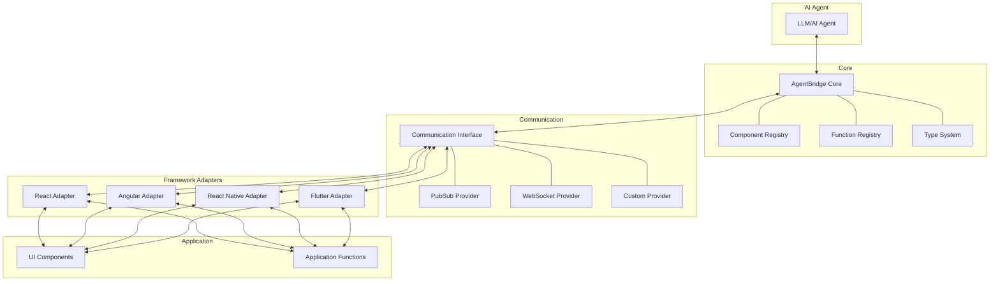

## Core Components

The core of AgentBridge consists of several key components that work together to provide a cohesive framework.

### Component Registry

The Component Registry maintains a list of UI components that are available to AI agents. Each component is registered with:

- A unique identifier
- Component type
- Properties and their current values
- Available actions

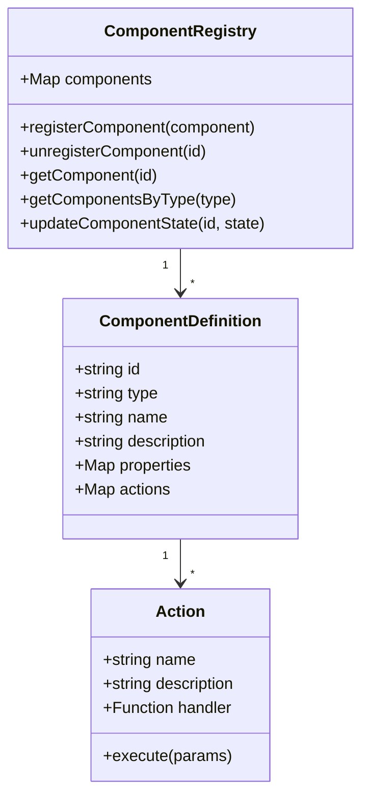

### Function Registry

The Function Registry maintains a list of functions that are exposed to AI agents:

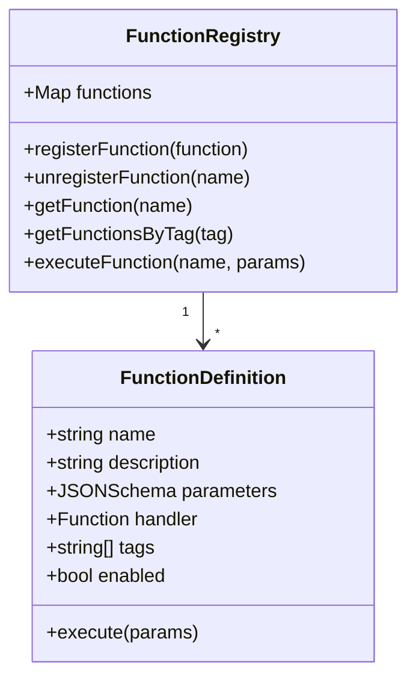

## Communication Flow

The detailed flow of information through the AgentBridge system:

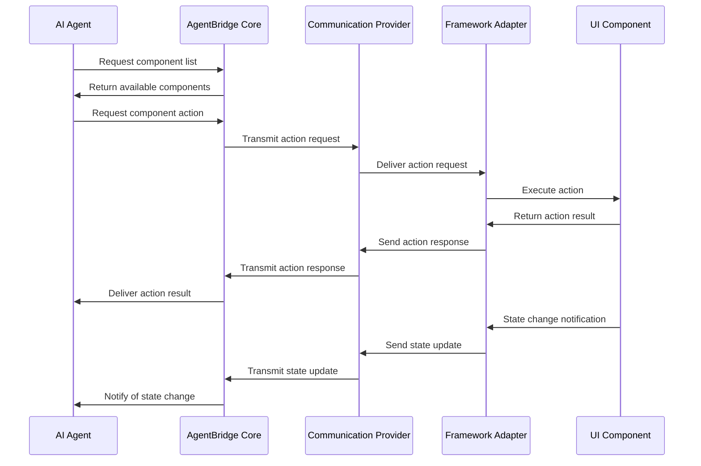

## Initialization Process

The initialization process of AgentBridge within an application:

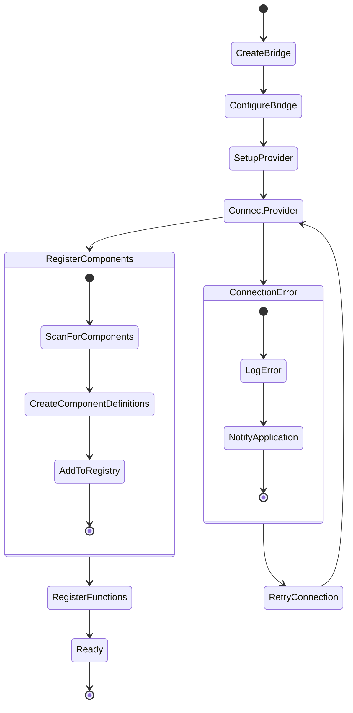

## System Overview

AgentBridge is designed to bridge the gap between AI agents and applications, providing a standardized way for agents to interact with UI components and application functionality.

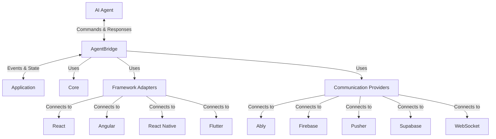

## Communication Modes

AgentBridge supports two primary communication modes:

### Pub/Sub Mode

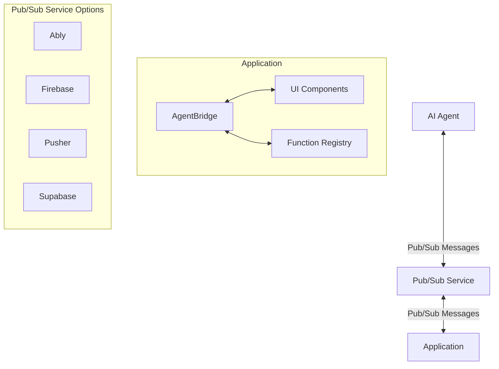

In Pub/Sub mode:
1. The application connects to a real-time messaging service
2. The AI agent connects to the same messaging service
3. They communicate via shared channels/topics
4. No backend is required for the application

Benefits:
- Simple to set up
- No need for a dedicated backend
- Multiple messaging providers supported

### Self-Hosted Mode

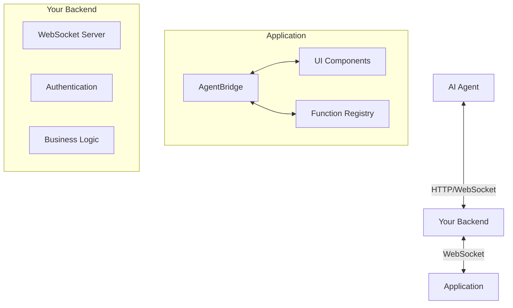

In Self-Hosted mode:
1. The application connects to your backend via WebSockets
2. The AI agent connects to your backend via HTTP/WebSockets
3. Your backend serves as a mediator
4. The backend can implement additional logic, authentication, etc.

Benefits:
- Complete control over communication
- Enhanced security options
- Integration with existing backend systems

## Package Structure

The AgentBridge framework is organized into the following packages:

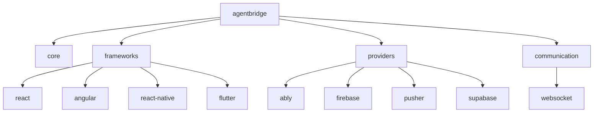

Each package has a specific responsibility:
- **core**: Core functionality and interfaces
- **frameworks**: Framework-specific implementations
- **providers**: Third-party service integrations
- **communication**: Communication protocol implementations

## Message Protocol

AgentBridge uses a standardized message protocol for communication between AI agents and applications. See the [Communication Protocol](communication-protocol.md) for details.

## Security

Security is a critical aspect of the AgentBridge architecture. The framework includes:
- Authentication mechanisms
- Authorization controls
- Input/output validation
- Transport security

For more details, see the [Security documentation](../advanced/security.md).

## Integration Patterns

### Basic Integration

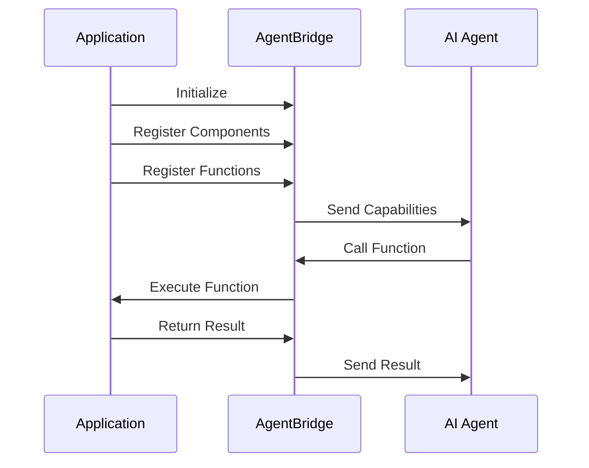

### Component Integration

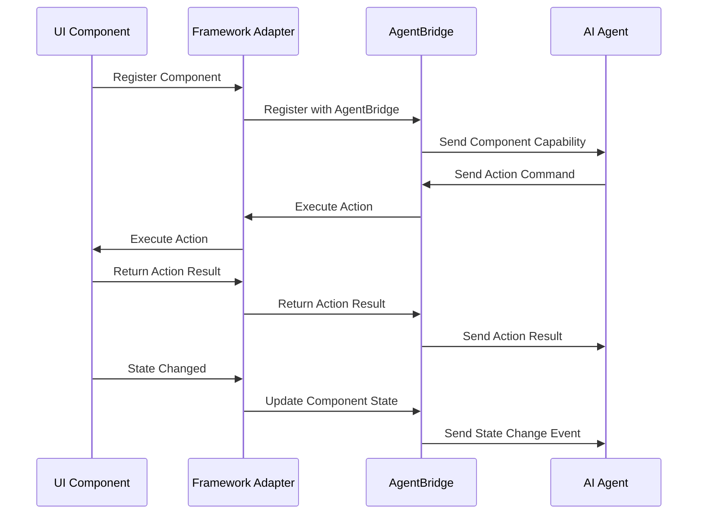

## Next Steps

- Read the [API Reference](api-reference.md) for detailed documentation
- See the [Function Registry](function-registry.md) and [Component Registry](component-registry.md) documentation
- Explore [Security considerations](../advanced/security.md) for secure implementations 