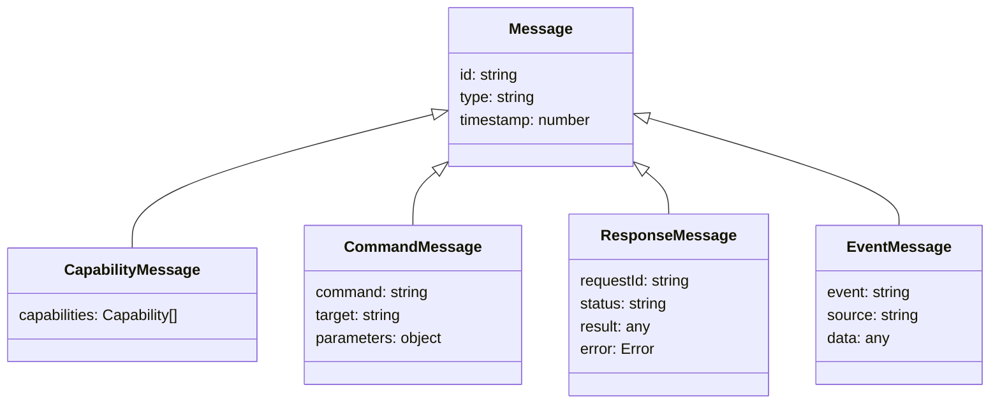
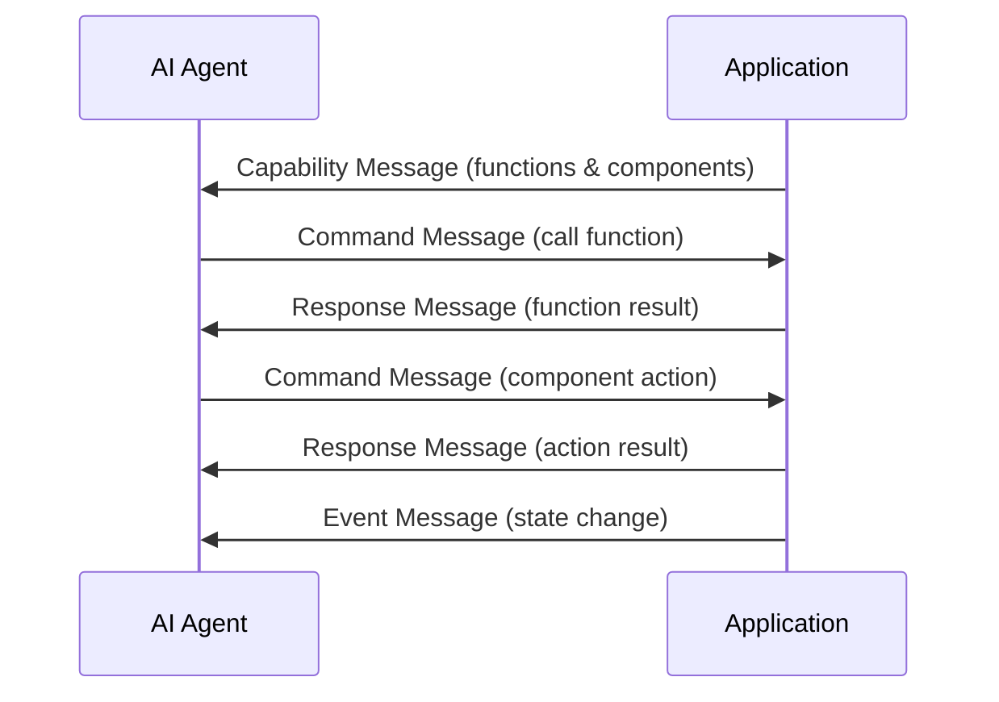

# Communication Protocol

The AgentBridge communication protocol defines how AI agents interact with applications through standardized messages. This protocol ensures consistency across different platforms and communication providers.

## Message Types

AgentBridge uses the following primary message types:



### Capability Messages

Sent from the application to the agent to describe available functions and components.

```json
{
  "id": "cap-123",
  "type": "capability",
  "timestamp": 1618825200000,
  "capabilities": [
    {
      "type": "function",
      "name": "getWeather",
      "description": "Get weather information for a location",
      "parameters": {
        "type": "object",
        "properties": {
          "location": { "type": "string" },
          "units": { "type": "string", "enum": ["metric", "imperial"] }
        },
        "required": ["location"]
      }
    },
    {
      "type": "component",
      "id": "submit-button",
      "componentType": "button",
      "properties": {
        "label": "Submit",
        "disabled": false
      },
      "actions": ["click"]
    }
  ]
}
```

### Command Messages

Sent from the agent to the application to call functions or control components.

```json
{
  "id": "cmd-456",
  "type": "command",
  "timestamp": 1618825205000,
  "command": "call",
  "target": "getWeather",
  "parameters": {
    "location": "New York",
    "units": "metric"
  }
}
```

For component actions:

```json
{
  "id": "cmd-789",
  "type": "command",
  "timestamp": 1618825210000,
  "command": "action",
  "target": "submit-button",
  "action": "click",
  "parameters": {}
}
```

### Response Messages

Sent from the application to the agent in response to command messages.

```json
{
  "id": "res-456",
  "type": "response",
  "timestamp": 1618825207000,
  "requestId": "cmd-456",
  "status": "success",
  "result": {
    "temperature": 22,
    "conditions": "sunny",
    "humidity": 45
  }
}
```

Error response:

```json
{
  "id": "res-789",
  "type": "response",
  "timestamp": 1618825212000,
  "requestId": "cmd-789",
  "status": "error",
  "error": {
    "code": "component_not_found",
    "message": "Component with ID 'submit-button' not found"
  }
}
```

### Event Messages

Sent from the application to the agent to notify about state changes or other events.

```json
{
  "id": "evt-123",
  "type": "event",
  "timestamp": 1618825220000,
  "event": "state_changed",
  "source": "submit-button",
  "data": {
    "properties": {
      "disabled": true
    }
  }
}
```

## Message Flow

The typical flow of communication between an AI agent and application:



## Transport Layer

The protocol is transport-agnostic and can be implemented over:

1. **WebSockets**: For self-hosted mode with direct communication
2. **Pub/Sub**: For applications without backends using third-party messaging services
3. **HTTP**: For simple request/response patterns

## Security Considerations

The protocol includes several security features:

1. **Message Authentication**: Messages can include authentication information
2. **Permissions**: Capability messages can specify required permissions
3. **Rate Limiting**: Implementations can enforce rate limits on commands
4. **Input Validation**: All parameters should be validated using the type system

## Extending the Protocol

The protocol can be extended with custom message types by following these guidelines:

1. Maintain the core message structure (id, type, timestamp)
2. Use descriptive and consistent naming for new message types
3. Document the purpose and structure of custom messages
4. Ensure backward compatibility when adding new fields

## Implementation Guidelines

When implementing the AgentBridge protocol:

1. Handle message ordering correctly
2. Implement proper error handling
3. Add timeouts for pending responses
4. Include retry logic for failed commands
5. Maintain a message queue for reliability

## Related Documentation

- [Type System](type-system.md): Used for validating message parameters
- [Function Registry](function-registry.md): Defines callable functions
- [Component Registry](component-registry.md): Manages UI components 