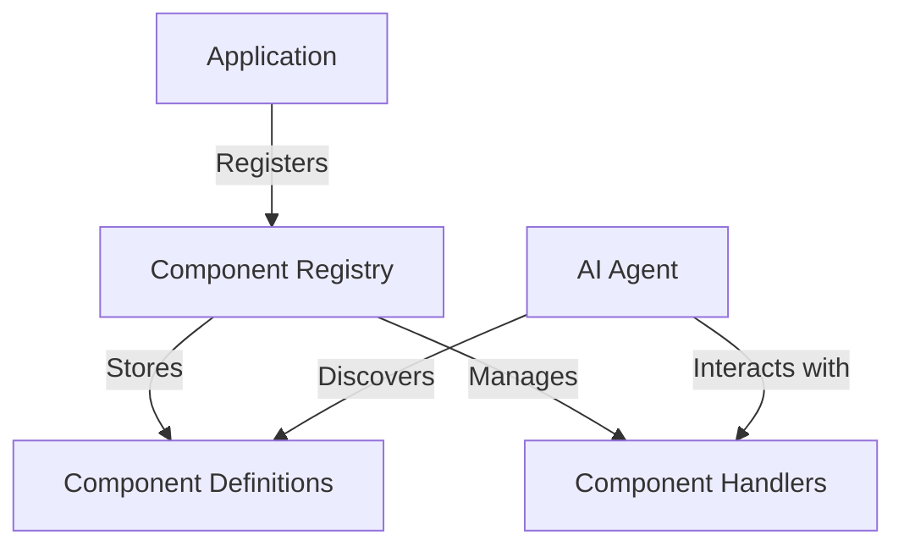
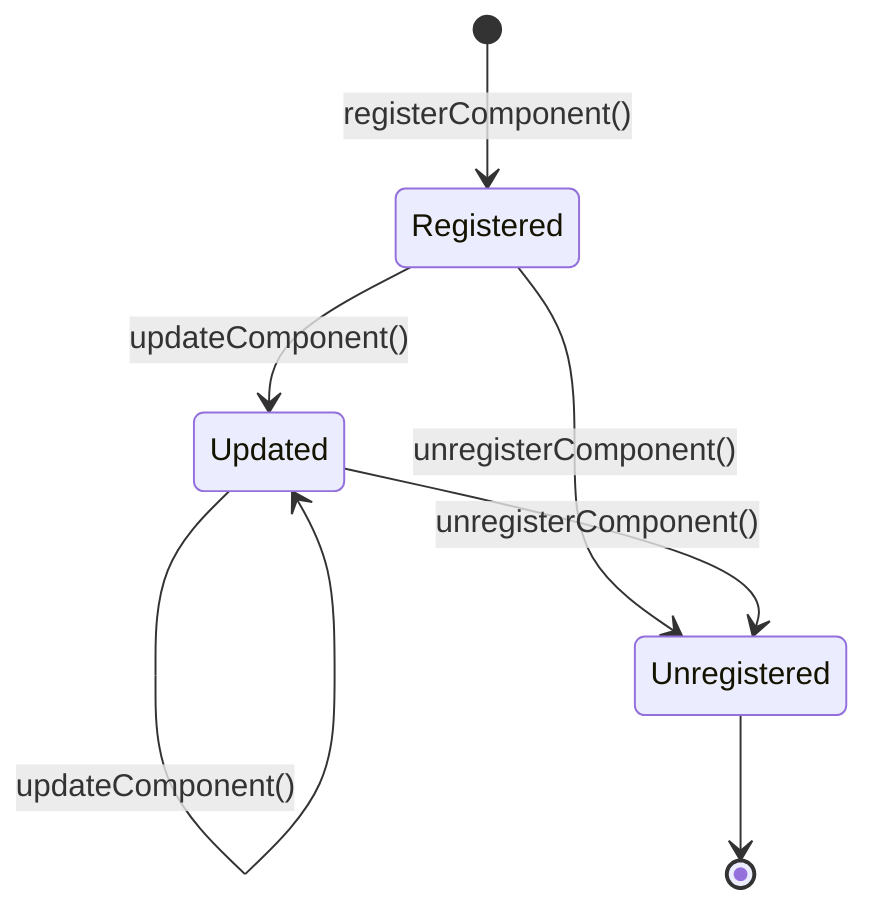

# Component Registry

The Component Registry is a core part of the AgentBridge framework that manages UI components that can be controlled by AI agents. It provides a mechanism for registering, tracking, and accessing components across your application.

## Overview

The Component Registry maintains a collection of UI components that have been registered with AgentBridge. Each component is registered with:

- A unique identifier
- A component definition that describes the component's properties and actions
- Handlers for executing actions on the component



## Component Definition

A component definition describes what a component is and what it can do:

```typescript
interface ComponentDefinition {
  type: string;
  properties: {
    [key: string]: any;
  };
  actions: string[];
  metadata?: {
    [key: string]: any;
  };
}
```

- `type`: The component type (e.g., "button", "textfield", "dropdown")
- `properties`: Object describing the component's properties
- `actions`: Array of action names that can be performed on the component
- `metadata`: Optional additional information about the component

## Registering Components

Components are typically registered through framework-specific adapters:

```typescript
// Example of registering a component
bridge.registerComponent(
  "submit-button",
  {
    type: "button",
    properties: {
      label: "Submit",
      disabled: false
    },
    actions: ["click"]
  },
  {
    // Action handlers
    click: async () => {
      // Handle click action
      return { success: true };
    }
  }
);
```

## Component Handlers

Component handlers are functions that execute actions on components:

```typescript
interface ComponentHandlers {
  [actionName: string]: (params?: any) => Promise<any>;
}
```

Each handler:
- Takes optional parameters
- Returns a promise that resolves to the result of the action
- May throw errors if the action cannot be performed

## Accessing Components

AI agents can access registered components through the component registry:

```typescript
// Get all registered components
const components = bridge.getRegisteredComponents();

// Get a specific component by ID
const component = bridge.getComponent("submit-button");

// Execute an action on a component
const result = await bridge.executeAction("submit-button", "click");
```

## Component Lifecycle

Components have a lifecycle within the registry:

1. **Registration**: Component is added to the registry
2. **Updates**: Component properties may be updated over time
3. **Unregistration**: Component is removed from the registry (e.g., when unmounted)



## Best Practices

When working with the Component Registry:

1. **Unique IDs**: Ensure each component has a unique identifier
2. **Descriptive Properties**: Make properties descriptive and meaningful
3. **Consistent Action Names**: Use consistent naming for similar actions
4. **Error Handling**: Implement proper error handling in action handlers
5. **Cleanup**: Always unregister components when they are no longer needed

## Related Documentation

- [Function Registry](function-registry.md): Register functions that can be called by AI agents
- [Type System](type-system.md): Define and validate component properties and action parameters 