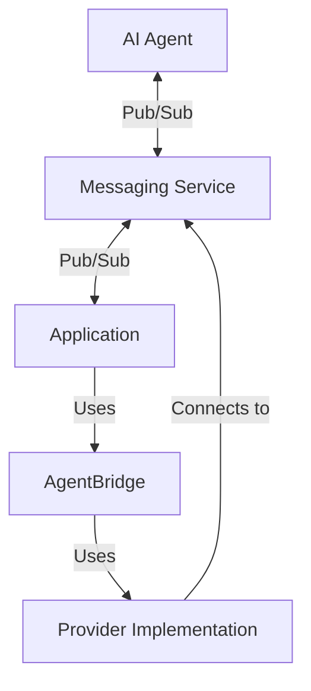
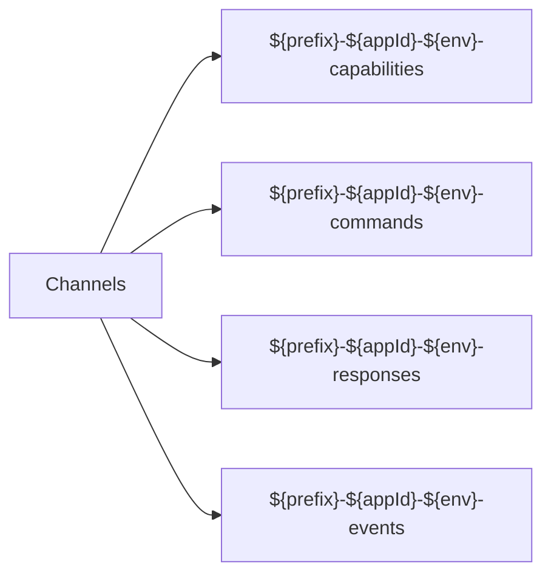

# Pub/Sub Configuration

This document outlines the configuration options for setting up the pub/sub communication mode in AgentBridge.

## Overview

The pub/sub communication mode uses third-party messaging services to facilitate communication between AI agents and your application without requiring a dedicated backend.



## Supported Providers

AgentBridge supports several pub/sub providers:

1. **Ably**
2. **Firebase Realtime Database**
3. **Pusher**
4. **Supabase Realtime**

## Configuration Options

### Common Options

All pub/sub providers support these common configuration options:

| Option | Type | Description | Default |
|--------|------|-------------|---------|
| `applicationId` | string | Unique identifier for your application | *Required* |
| `environmentId` | string | Environment (e.g., "development", "production") | "development" |
| `channelPrefix` | string | Prefix for channel names | "agentbridge" |
| `capabilities` | object | Configuration for capability announcements | `{ interval: 30000 }` |
| `reconnect` | object | Reconnection behavior | `{ maxAttempts: 10, delay: 1000 }` |

### Provider-Specific Options

#### Ably Provider

```javascript
import { AgentBridge } from '@agentbridge/core';
import { AblyProvider } from '@agentbridge/provider-ably';

const ablyProvider = new AblyProvider({
  apiKey: 'your-ably-api-key',
  clientId: 'optional-client-id',
  authUrl: 'optional-auth-url',
  authMethod: 'GET',
  authHeaders: {},
  authParams: {},
  useTokenAuth: false,
  channelPrefix: 'custom-prefix'
});

const bridge = new AgentBridge({
  applicationId: 'my-app-123',
  environmentId: 'development'
});

bridge.initialize(ablyProvider);
```

#### Firebase Provider

```javascript
import { AgentBridge } from '@agentbridge/core';
import { FirebaseProvider } from '@agentbridge/provider-firebase';

const firebaseProvider = new FirebaseProvider({
  // Firebase config
  firebaseConfig: {
    apiKey: 'your-api-key',
    authDomain: 'your-auth-domain',
    databaseURL: 'your-database-url',
    projectId: 'your-project-id',
    storageBucket: 'your-storage-bucket',
    messagingSenderId: 'your-messaging-sender-id',
    appId: 'your-app-id'
  },
  // Optional: custom Firebase app instance
  firebaseApp: customFirebaseApp,
  // Optional: authentication
  auth: {
    anonymous: true,
    // Or custom token
    customToken: 'your-custom-token'
    // Or email/password
    email: 'user@example.com',
    password: 'password'
  },
  channelPrefix: 'custom-prefix'
});

const bridge = new AgentBridge({
  applicationId: 'my-app-123',
  environmentId: 'development'
});

bridge.initialize(firebaseProvider);
```

#### Pusher Provider

```javascript
import { AgentBridge } from '@agentbridge/core';
import { PusherProvider } from '@agentbridge/provider-pusher';

const pusherProvider = new PusherProvider({
  // Pusher key
  key: 'your-pusher-key',
  // Pusher options
  cluster: 'eu',
  forceTLS: true,
  // Optional: authorization endpoint
  authEndpoint: 'https://your-auth-endpoint.com/pusher/auth',
  auth: {
    headers: { 'X-Custom-Header': 'value' }
  },
  channelPrefix: 'custom-prefix'
});

const bridge = new AgentBridge({
  applicationId: 'my-app-123',
  environmentId: 'development'
});

bridge.initialize(pusherProvider);
```

#### Supabase Provider

```javascript
import { AgentBridge } from '@agentbridge/core';
import { SupabaseProvider } from '@agentbridge/provider-supabase';

const supabaseProvider = new SupabaseProvider({
  // Supabase URL and key
  supabaseUrl: 'https://your-project.supabase.co',
  supabaseKey: 'your-supabase-key',
  // Optional: custom Supabase client
  supabaseClient: customSupabaseClient,
  // Optional: channel options
  channelOptions: {
    config: {
      broadcast: { self: true }
    }
  },
  channelPrefix: 'custom-prefix'
});

const bridge = new AgentBridge({
  applicationId: 'my-app-123',
  environmentId: 'development'
});

bridge.initialize(supabaseProvider);
```

## Channel Structure

Pub/sub providers use the following channel structure:



Where:
- `prefix` is the channel prefix (default: "agentbridge")
- `appId` is your application ID
- `env` is your environment ID

## Security Considerations

When using pub/sub providers, consider the following security aspects:

1. **API Key Management**:
   - Keep API keys secure and never expose them in client-side code
   - Use environment variables for API keys
   - Consider using API key rotation strategies

2. **Authentication**:
   - Use token-based authentication when possible
   - Implement server-side authentication for sensitive operations

3. **Authorization**:
   - Use private channels with authentication for sensitive data
   - Implement authorization checks in your message handlers

4. **Data Validation**:
   - Validate all incoming messages before processing
   - Use the AgentBridge type system to validate parameters

For more comprehensive security guidance, see the [Security Best Practices](../advanced/security.md) documentation.

## Advanced Configuration

### Custom Provider

You can create a custom pub/sub provider by implementing the `CommunicationProvider` interface:

```typescript
import { CommunicationProvider, Message } from '@agentbridge/core';

class CustomPubSubProvider implements CommunicationProvider {
  constructor(options) {
    // Initialize your provider
  }

  async connect(): Promise<void> {
    // Establish connection
  }

  async disconnect(): Promise<void> {
    // Close connection
  }

  async sendMessage(message: Message): Promise<void> {
    // Send a message
  }

  onMessage(callback: (message: Message) => void): void {
    // Register message handler
  }

  onConnectionStatusChange(callback: (status: string) => void): void {
    // Register connection status handler
  }
}
```

### Error Handling

Configure how your application handles communication errors:

```javascript
bridge.on('error', (error) => {
  console.error('AgentBridge error:', error);
  
  // Implement custom error handling
  if (error.code === 'connection_lost') {
    // Handle connection issues
  } else if (error.code === 'message_failed') {
    // Handle message delivery failures
  }
});
```

## Next Steps

- Learn about the [Communication Protocol](communication-protocol.md)
- Explore [WebSocket Configuration](websocket-config.md) for self-hosted mode
- See [Security Best Practices](../advanced/security.md) for securing your implementation 