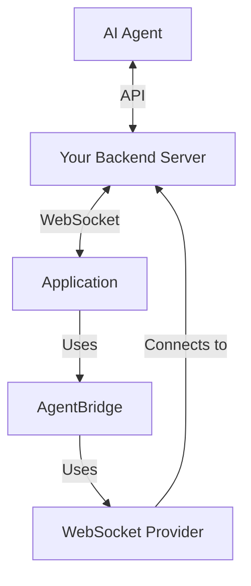

# WebSocket Configuration

This document outlines the configuration options for setting up the self-hosted WebSocket communication mode in AgentBridge.

## Overview

The self-hosted communication mode uses WebSockets to establish direct communication between your application and a backend server, which then mediates communication with AI agents.



## WebSocket Provider Configuration

The WebSocket provider connects your application to your backend server:

```javascript
import { AgentBridge } from '@agentbridge/core';
import { WebSocketProvider } from '@agentbridge/communication-websocket';

const wsProvider = new WebSocketProvider({
  // Required: WebSocket server URL
  url: 'wss://your-server.com/agent-bridge',
  
  // Optional: Authentication options
  auth: {
    type: 'token', // or 'basic'
    token: 'your-auth-token',
    // Or for basic auth:
    // username: 'username',
    // password: 'password'
  },
  
  // Optional: Custom headers
  headers: {
    'X-Custom-Header': 'value'
  },
  
  // Optional: Reconnection settings
  reconnect: {
    enabled: true,
    maxAttempts: 10,
    delay: 1000, // ms
    maxDelay: 30000, // ms
    backoff: 1.5 // exponential backoff factor
  },
  
  // Optional: Ping/pong configuration
  pingInterval: 30000, // ms
  
  // Optional: Protocol version
  protocolVersion: '1.0',
  
  // Optional: Debug mode
  debug: false
});

const bridge = new AgentBridge({
  applicationId: 'my-app-123',
  environmentId: 'development'
});

bridge.initialize(wsProvider);
```

## Connection Authentication

### Token Authentication

```javascript
const wsProvider = new WebSocketProvider({
  url: 'wss://your-server.com/agent-bridge',
  auth: {
    type: 'token',
    token: 'your-auth-token'
  }
});
```

### JWT Authentication

```javascript
// Obtain JWT from your authentication service
const jwt = await authService.getToken();

const wsProvider = new WebSocketProvider({
  url: 'wss://your-server.com/agent-bridge',
  headers: {
    'Authorization': `Bearer ${jwt}`
  }
});
```

### Basic Authentication

```javascript
const wsProvider = new WebSocketProvider({
  url: 'wss://your-server.com/agent-bridge',
  auth: {
    type: 'basic',
    username: 'username',
    password: 'password'
  }
});
```

## Connection Events

The WebSocket provider emits several connection-related events:

```javascript
wsProvider.on('connecting', () => {
  console.log('Connecting to WebSocket server...');
});

wsProvider.on('connected', () => {
  console.log('Connected to WebSocket server');
});

wsProvider.on('disconnected', (reason) => {
  console.log(`Disconnected from WebSocket server: ${reason}`);
});

wsProvider.on('reconnecting', (attempt) => {
  console.log(`Reconnection attempt ${attempt}...`);
});

wsProvider.on('error', (error) => {
  console.error('WebSocket error:', error);
});
```

## Message Protocol

AgentBridge uses a standardized message protocol over WebSockets. See the [Communication Protocol](communication-protocol.md) for the message format details.

## Backend Server Requirements

Your backend server must implement the following:

### 1. WebSocket Connection Handling

```javascript
// Example using Node.js and ws library
const WebSocket = require('ws');
const server = new WebSocket.Server({ port: 8080 });

server.on('connection', (ws, req) => {
  // Handle new connections
  console.log('Client connected');
  
  // Authentication (example)
  const token = req.headers['authorization']?.split(' ')[1];
  if (!validateToken(token)) {
    ws.close(4001, 'Unauthorized');
    return;
  }
  
  // Handle messages
  ws.on('message', (message) => {
    const parsedMessage = JSON.parse(message);
    handleMessage(parsedMessage, ws);
  });
  
  // Handle disconnection
  ws.on('close', () => {
    console.log('Client disconnected');
  });
});
```

### 2. Message Routing

```javascript
function handleMessage(message, ws) {
  switch (message.type) {
    case 'capability':
      // Store capabilities for this client
      storeCapabilities(message, ws);
      break;
      
    case 'command':
      // Route command to appropriate handler
      handleCommand(message, ws);
      break;
      
    case 'response':
      // Route response to appropriate agent
      routeResponseToAgent(message);
      break;
      
    case 'event':
      // Handle events
      handleEvent(message);
      break;
      
    default:
      console.warn(`Unknown message type: ${message.type}`);
  }
}
```

### 3. Agent API Integration

Your backend server should also provide an API for AI agents to:

1. Discover available components and functions
2. Send commands to the application
3. Receive responses from the application

## Security Considerations

### Transport Security

Always use WSS (WebSocket Secure) instead of WS:

```javascript
const wsProvider = new WebSocketProvider({
  url: 'wss://your-server.com/agent-bridge', // Use wss:// not ws://
  // ...
});
```

### Authentication

Implement robust authentication:

```javascript
// Server-side authentication check
function validateToken(token) {
  try {
    // Verify JWT token
    const decoded = jwt.verify(token, process.env.JWT_SECRET);
    return !!decoded;
  } catch (error) {
    console.error('Token validation error:', error);
    return false;
  }
}
```

### Authorization

Implement per-function and per-component authorization:

```javascript
// Server-side authorization check
function authorizeCommand(command, user) {
  // Check if user has permission to execute this command
  const { target, action } = command;
  
  // Example: Only admin users can access admin functions
  if (target.startsWith('admin:') && user.role !== 'admin') {
    return false;
  }
  
  return true;
}
```

For more comprehensive security guidance, see the [Security Best Practices](../advanced/security.md) documentation.

## Advanced Configuration

### Connection Pooling

For applications with multiple instances:

```javascript
// Server-side connection pooling
const connectionPool = new Map();

server.on('connection', (ws, req) => {
  const clientId = extractClientId(req);
  
  // Store connection in pool
  connectionPool.set(clientId, ws);
  
  ws.on('close', () => {
    // Remove from pool on disconnect
    connectionPool.delete(clientId);
  });
});

// Function to send message to specific client
function sendToClient(clientId, message) {
  const client = connectionPool.get(clientId);
  if (client && client.readyState === WebSocket.OPEN) {
    client.send(JSON.stringify(message));
    return true;
  }
  return false;
}
```

### Custom Middleware

Adding middleware for message processing:

```javascript
// Client-side middleware
wsProvider.use((message, next) => {
  // Add timestamp to outgoing messages
  message.timestamp = Date.now();
  next();
});

// Server-side middleware
function messageMiddleware(message, next) {
  // Log all messages
  logger.debug('Received message:', message.id, message.type);
  
  // Continue processing
  next();
}
```

## Troubleshooting

### Connection Issues

If you're experiencing WebSocket connection issues:

1. **Check URL**: Ensure the WebSocket URL is correct and accessible
2. **Verify SSL/TLS**: If using WSS, verify certificates are valid
3. **Check Proxies**: Some proxies may interfere with WebSocket connections
4. **Firewall Settings**: Ensure your firewall allows WebSocket connections
5. **Heartbeat Failures**: Check pingInterval configuration

### Message Delivery Problems

If messages aren't being delivered:

1. **Check Connection State**: Ensure WebSocket is connected before sending
2. **Message Format**: Verify messages match the expected format
3. **Size Limits**: Some WebSocket servers have message size limits
4. **Rate Limiting**: Check for rate limiting on your server

## Next Steps

- Learn about the [Communication Protocol](communication-protocol.md)
- Explore [Pub/Sub Configuration](pubsub-config.md) for backendless mode
- See [Security Best Practices](../advanced/security.md) for securing your implementation 