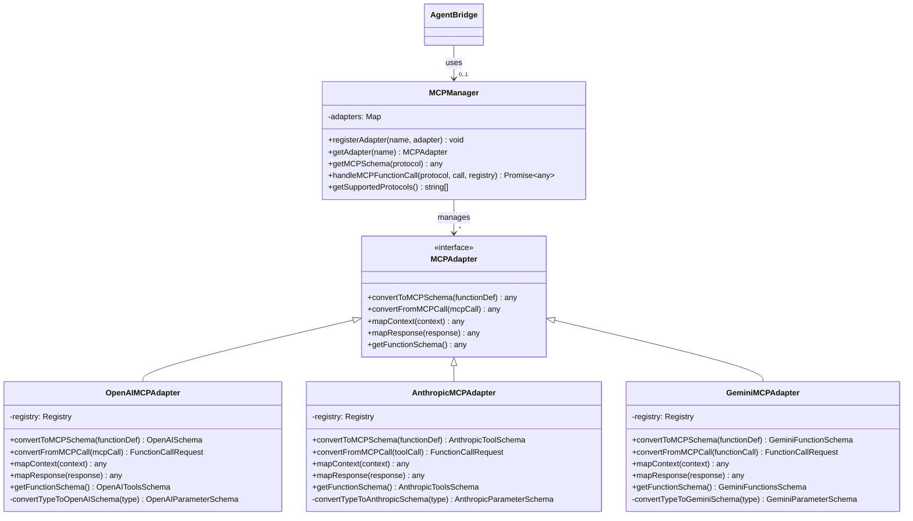

# AgentBridge Architecture

This document provides an overview of the AgentBridge framework architecture, explaining how the different components work together to enable AI agents to interact with applications.

## Overview

AgentBridge is designed with a modular architecture that separates the core functionality from the platform-specific implementations. This allows for consistent behavior across different platforms and frameworks while enabling platform-specific optimizations.

## Core Components

### AgentBridge

The `AgentBridge` class is the central component of the framework. It provides the following functionality:

- Function registration and execution
- Authentication and authorization
- Context management
- Type validation
- Error handling

The core functionality is platform-agnostic and is used by all platform-specific adapters.

### FrameworkAdapter

The `FrameworkAdapter` interface defines the contract that all platform-specific adapters must implement. It includes methods for:

- Initializing the adapter
- Registering UI components
- Handling function calls
- Converting between different frameworks

### Registry

The `Registry` class manages the registration and lookup of functions. It provides:

- Function registration
- Function lookup
- Authentication checks
- Rate limiting

### Type System

The type system provides validation for function parameters and return values. It ensures that functions are called with the correct parameters and that they return valid results.

## Adapter Architecture

Each supported platform has its own adapter that implements the `FrameworkAdapter` interface. The adapters provide platform-specific functionality while maintaining a consistent API.

### React Adapter

The React adapter (`ReactAdapter`) integrates AgentBridge with React applications. It provides:

- React-specific hooks and components
- Integration with React's component lifecycle
- Context-based state management

### Angular Adapter

The Angular adapter (`AngularAdapter`) integrates AgentBridge with Angular applications. It provides:

- Angular services and components
- Integration with Angular's dependency injection
- Observable-based state management

### React Native Adapter

The React Native adapter extends the React adapter with mobile-specific functionality. It adds:

- Mobile device API access
- React Native component integration
- Mobile-specific context information

### Flutter Adapter

The Flutter adapter (`FlutterAdapter`) integrates AgentBridge with Flutter applications. It provides:

- Flutter widgets and services
- Integration with Flutter's widget lifecycle
- Mobile-specific functions

## Component Integration

AgentBridge allows AI agents to interact with UI components through a component registry system.

### Component Registry

The component registry tracks all registered UI components and their current state. It allows AI agents to:

- Discover available components
- Read component properties and state
- Update component state
- Trigger component events

### Component Registration Process

1. A UI component (button, input, etc.) is rendered in the application
2. The component registers itself with AgentBridge through the framework adapter
3. The component provides its ID, type, and initial properties
4. AgentBridge adds the component to the registry

### Component Interaction Process

1. An AI agent discovers available components through the `getComponents` function
2. The agent selects a component to interact with based on its ID or type
3. The agent calls a function to update the component's state or trigger an event
4. The framework adapter handles the function call and updates the component
5. The component re-renders with the updated state

## Function Calling Process

When an AI agent calls a function through AgentBridge, the following process occurs:

1. The agent sends a function call request with the function name, parameters, and context
2. AgentBridge validates the request (authentication, parameters, rate limits, etc.)
3. AgentBridge looks up the function in the registry
4. The function is executed with the provided parameters and context
5. The result is returned to the agent

## Context Management

AgentBridge provides context information to functions when they are called. This context includes:

- Agent information (ID, name, capabilities)
- User information (if authenticated)
- Application information (ID, environment)
- Request information (IP, timestamp, etc.)

## Security Model

AgentBridge includes several security features:

### Authentication

Functions can require authentication to be called. AgentBridge supports different authentication levels:

- `public`: No authentication required
- `user`: User authentication required
- `admin`: Administrative privileges required

### Rate Limiting

Functions can be rate-limited to prevent abuse. Rate limits can be set per function and include:

- Maximum number of requests
- Time window for rate limiting
- Scope of rate limiting (per user, per IP, global)

### Permissions

Functions can check permissions before executing. Permissions can be based on:

- User roles
- Custom permission logic
- Application-specific rules

## Error Handling

AgentBridge provides structured error handling for function calls:

- Each function call returns a result object with success/error information
- Errors include a code, message, and optional details
- Execution metadata (duration, timestamps) is included in the result

## Cross-Framework Interoperability

AgentBridge allows components from different frameworks to interact with each other through a common interface. This is achieved through:

- Framework adapters that implement a common interface
- A serialization format for component state
- Conversion functions for component properties

## Extension Points

AgentBridge can be extended in several ways:

- Custom adapters for new frameworks
- Custom component types
- Custom function implementations
- Custom authentication providers
- Custom type validators

## Package Structure

The AgentBridge framework is organized into the following packages:

- `@agentbridge/core`: Core functionality, type system, registry
- `@agentbridge/react`: React integration
- `@agentbridge/angular`: Angular integration
- `@agentbridge/react-native`: React Native integration
- `agentbridge` (Flutter): Flutter integration

## Dependency Graph

## Performance Considerations

AgentBridge is designed with performance in mind:

- Component state updates are optimized to minimize re-renders
- Function calls are validated early to prevent unnecessary execution
- The registry uses efficient lookup mechanisms
- Adapters use platform-specific optimizations

## Testing Strategy

AgentBridge can be tested at different levels:

- Unit tests for core functionality
- Component tests for UI components
- Integration tests for function calling
- End-to-end tests for AI agent interactions

## Deployment Architecture

The AgentBridge packages can be deployed in several configurations, depending on the application's requirements.

## Model Context Protocols (MCPs) Integration

AgentBridge can be extended to support Model Context Protocols, enabling standardized communication between AI models and applications. The MCP support is built as an **optional feature** that can be enabled as needed without affecting existing functionality.

### Optional MCP Architecture

The MCP integration is designed to be completely optional, allowing applications to use AgentBridge with or without MCP support. The components are lazy-loaded and only initialized when explicitly requested. This ensures:

1. **No Performance Impact**: Applications that don't use MCPs won't experience any overhead
2. **Backward Compatibility**: Existing code continues to work without modification
3. **Progressive Adoption**: MCP support can be added incrementally to existing applications

### MCP Adapter Design

MCP adapters follow a common interface but implement protocol-specific logic. The class diagram below shows the relationship between different adapter implementations:

### Design Information Collection

The design information collection system captures the structure and appearance of UI components, enabling AI agents to understand and interact with application interfaces more effectively.

### Enabling MCP Support

The MCP support is enabled on-demand through explicit integration points in the AgentBridge API:

### Type Translation

A key aspect of MCP integration is the translation between AgentBridge types and MCP-specific schemas:

### Package Structure with MCP Support

The MCP support is integrated into the existing package structure without disrupting it:

## Function Call Process with MCPs

The following sequence diagram shows how function calls are processed through the MCP layer:

## Future Architecture Directions

Future enhancements to the AgentBridge architecture may include:

- Server-side rendering support
- WebSocket-based real-time updates
- Component synchronization across devices
- Enhanced MCP support for multiple AI platforms
- AI agent capability discovery
- Enhanced type system with runtime validation
- Additional design information collection mechanisms
- Advanced UI reasoning capabilities for AI agents 