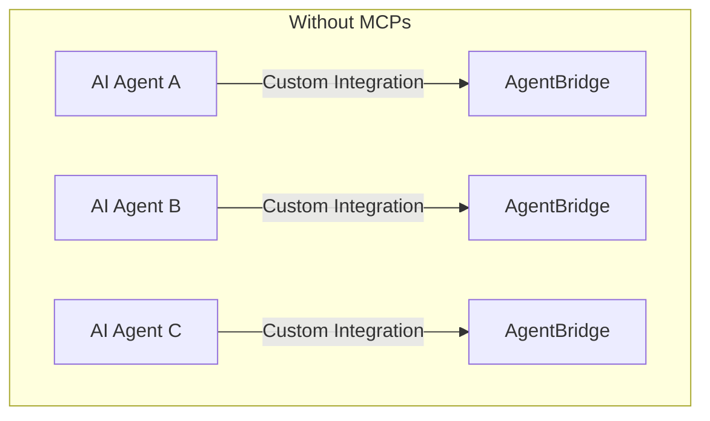
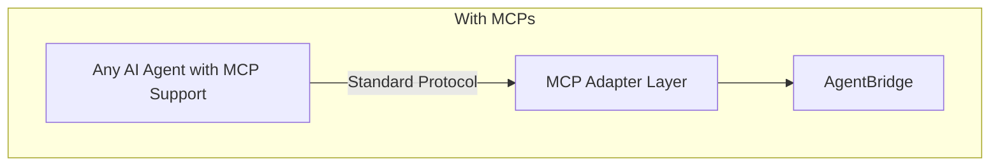

# Model Context Protocols (MCPs) Integration Evaluation

This document evaluates the potential integration of Model Context Protocols (MCPs) into the AgentBridge framework, addressing key considerations for implementation and expected benefits.

## What are Model Context Protocols?

Model Context Protocols (MCPs) are open standards that define how AI models can seamlessly connect to external data sources, tools, or services. They provide a standardized way for AI agents to:

- Discover available functions and tools
- Exchange context information in real time
- Maintain consistent communication across various systems
- Call external functions with standardized parameter formats
- Process responses in a consistent manner

MCPs act as a universal "connector" or "adapter" between an AI agent's internal context and the real-world data and functionality it needs to access.

## Current AgentBridge Architecture

AgentBridge currently provides a framework for exposing application functionality to AI agents, but without a standardized protocol for discovery and interaction. The current approach requires:

- Custom integration code for each AI model integration
- Proprietary function definition formats
- Application-specific context management
- Custom type definitions and validations

While functional, this approach limits interoperability and increases the complexity of integrating with new AI platforms.



## Key Evaluation Questions

### 1. Discovery & Consumption

**Question**: Can our agents dynamically discover and call the exposed SDK functions through an MCP-based protocol?

**Analysis**:

Integrating MCPs would provide significant improvements to function discovery and consumption:

- **Dynamic Function Discovery**: MCPs would allow AI agents to dynamically discover available functions in the AgentBridge registry without prior knowledge of the application's capabilities.

- **Schema-Based Discoverability**: Function parameters, types, and descriptions would be exposed in a standardized format that any MCP-compatible AI agent could understand.

- **Runtime Adaptability**: As new functions are registered with AgentBridge, they would automatically become available to AI agents without requiring code changes.

- **Consistent Invocation Format**: All function calls would follow the same standardized pattern, simplifying integration with different AI models.

**Implementation Requirements**:

- Extend the function registry to expose functions in MCP-compatible format
- Implement a discovery endpoint/mechanism that adheres to MCP specifications
- Create schema translation utilities to convert between AgentBridge and MCP type formats
- Build examples demonstrating dynamic discovery

### 2. Context Management

**Question**: How would MCPs help maintain and pass the necessary context between our agents and the SDKs?

**Analysis**:

MCPs would significantly improve context management in the AgentBridge ecosystem:

- **Standardized Context Format**: MCPs define a standard format for context information, ensuring consistent context handling across different AI platforms.

- **Context Persistence**: MCPs include mechanisms for maintaining context across multiple function calls, enabling more complex agent interactions.

- **User Authentication Context**: MCPs can standardize how user authentication information is passed between agents and functions, improving security consistency.

- **Application State Sharing**: MCPs can standardize how application state is shared with AI agents, allowing for more contextually-aware interactions.

**Implementation Requirements**:

- Develop a context management system that adheres to MCP specifications
- Create context mappers to translate between AgentBridge's internal context and MCP context format
- Implement context persistence mechanisms
- Add context validation to ensure security

### 3. Standardization

**Question**: Would using MCPs standardize the interaction across different modules, making it easier for agents to operate regardless of the underlying data sources?

**Analysis**:

Adopting MCPs would significantly enhance standardization across the AgentBridge ecosystem:

- **Cross-Platform Consistency**: With MCPs, interactions would be consistent whether the agent is working with a React, Angular, Flutter, or any other platform implementation.

- **Reduced Integration Complexity**: New AI platforms could be integrated with minimal additional code if they support the same MCP standard.

- **Unified Type System**: MCPs define standard types that could be mapped to AgentBridge's type system, ensuring consistent validation.

- **Protocol Evolution**: As MCPs evolve with industry standards, AgentBridge would benefit from improvements without requiring major internal changes.

**Implementation Examples**:

```typescript
// Example of how a function might be registered with MCP support
agentBridge.registerFunction({
  name: 'getWeather',
  description: 'Get current weather for a location',
  parameters: {
    type: 'object',
    properties: {
      location: {
        type: 'string',
        description: 'City name or coordinates'
      },
      units: {
        type: 'string',
        enum: ['metric', 'imperial'],
        default: 'metric'
      }
    },
    required: ['location']
  },
  returnType: {
    type: 'object',
    properties: {
      temperature: { type: 'number' },
      conditions: { type: 'string' },
      humidity: { type: 'number' }
    }
  },
  handler: async (params, context) => {
    // Function implementation
    return {
      temperature: 22.5,
      conditions: 'Sunny',
      humidity: 45
    };
  }
});
```

### 4. Implementation Complexity

**Question**: What would be the effort required to integrate MCPs into our current architecture? Is this integration viable at this stage?

**Analysis**:

Implementing MCP support in AgentBridge would involve moderate complexity:

- **Adaptation Layer**: An MCP adapter component would need to be built to translate between AgentBridge's internal API and the MCP format.

- **Schema Mapping**: Mapping between AgentBridge's function definitions and MCP tool descriptions would require careful type translation.

- **Backward Compatibility**: The implementation should maintain backward compatibility with existing AgentBridge integrations.

- **Testing Requirements**: Comprehensive testing would be needed to ensure compatibility with different AI platforms and MCP implementations.

**Viability Assessment**:

MCP integration is highly viable at this stage for several reasons:

1. **Foundation Available**: AgentBridge already has most of the foundational components needed (function registry, type system, adapters).

2. **Incremental Implementation**: MCP support can be added incrementally without disrupting existing functionality.

3. **Return on Investment**: The effort required is moderate, but the benefits in terms of interoperability and standardization are substantial.

4. **Timing**: As MCPs are gaining industry adoption, implementing support now positions AgentBridge favorably in the ecosystem.



## Implementation Path

### Phase 1: Research and Design

1. **Standard Selection**: Evaluate and select specific MCP standards to implement (e.g., OpenAI's function calling schema, Anthropic's tool use schema)
2. **Gap Analysis**: Identify gaps between current AgentBridge capabilities and MCP requirements
3. **Architecture Design**: Design the MCP adapter component and integration points
4. **POC Development**: Create proof-of-concept implementations for key scenarios

### Phase 2: Core Implementation

1. **MCP Adapter Development**: Implement the core MCP adapter component
2. **Schema Translation**: Build utilities for translating between AgentBridge and MCP schemas
3. **Context Management**: Implement standardized context handling according to MCP specifications
4. **Discovery Mechanism**: Create MCP-compliant discovery endpoints/mechanisms

### Phase 3: Platform Integration and Testing

1. **AI Platform Testing**: Test with multiple AI platforms (OpenAI, Anthropic, etc.)
2. **Framework Adapter Updates**: Update framework adapters to leverage MCP capabilities
3. **Performance Optimization**: Optimize performance of the MCP integration
4. **Documentation**: Create comprehensive documentation for MCP integration

## Comparison of With and Without MCPs

| Aspect | Without MCPs | With MCPs |
|--------|--------------|-----------|
| **AI Platform Integration** | Custom integration for each platform | Standardized integration for all MCP-supporting platforms |
| **Function Discovery** | Manual documentation and configuration | Automatic, standardized discovery |
| **Type System** | Custom type definitions | Standard types with mapping to custom types |
| **Context Management** | Custom context handling | Standardized context format and persistence |
| **Maintenance Cost** | Higher (multiple custom integrations) | Lower (single standard to maintain) |
| **Extensibility** | Requires code changes for new capabilities | Dynamic discovery of new capabilities |
| **Developer Experience** | Varied across platforms | Consistent across platforms |

## Example: OpenAI Function Calling as MCP

OpenAI's function calling schema is an example of an emerging MCP standard. Here's how it might be integrated with AgentBridge:

```typescript
// Current AgentBridge function definition
agentBridge.registerFunction(
  'searchProducts',
  'Search for products in the inventory',
  {
    type: 'object',
    properties: {
      query: { type: 'string' },
      category: { type: 'string', optional: true },
      maxResults: { type: 'number', optional: true }
    }
  },
  async (params, context) => {
    // Function implementation
    return { results: [] };
  }
);

// With MCP adapter, this would automatically be exposed in OpenAI format:
{
  "name": "searchProducts",
  "description": "Search for products in the inventory",
  "parameters": {
    "type": "object",
    "properties": {
      "query": {
        "type": "string",
        "description": "Search query"
      },
      "category": {
        "type": "string",
        "description": "Product category"
      },
      "maxResults": {
        "type": "number",
        "description": "Maximum number of results to return"
      }
    },
    "required": ["query"]
  }
}
```

## Recommendations

Based on this evaluation, we recommend:

1. **Proceed with MCP Integration**: The benefits of standardization, improved discoverability, and reduced integration complexity justify the implementation effort.

2. **Phased Approach**: Implement MCP support incrementally, starting with the most widely adopted standards (e.g., OpenAI's function calling schema).

3. **Maintain Backward Compatibility**: Ensure that existing AgentBridge integrations continue to work without modification.

4. **Create Reference Implementations**: Develop comprehensive examples demonstrating MCP integration with different AI platforms.

5. **Documentation and Training**: Provide detailed documentation and training materials for developers implementing MCP-based integrations.

6. **Monitoring and Feedback**: Establish metrics to monitor the effectiveness of MCP integration and gather feedback for continuous improvement.

## Conclusion

Integrating Model Context Protocols into the AgentBridge framework would provide significant benefits in terms of standardization, discoverability, context management, and reduced integration complexity. The implementation effort is moderate and can be approached incrementally, with each phase delivering tangible benefits.

Given AgentBridge's goal of providing a unified interface for AI agents to interact with applications across different platforms and frameworks, MCP integration aligns perfectly with this mission and would position AgentBridge as a forward-thinking framework in the AI ecosystem.

By adopting MCPs, AgentBridge would enable more seamless integration with a wider range of AI platforms, reducing the burden on developers and enabling more sophisticated agent-application interactions. 