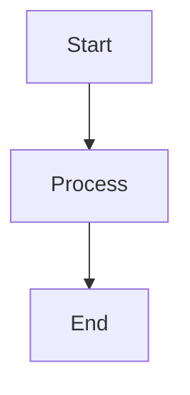
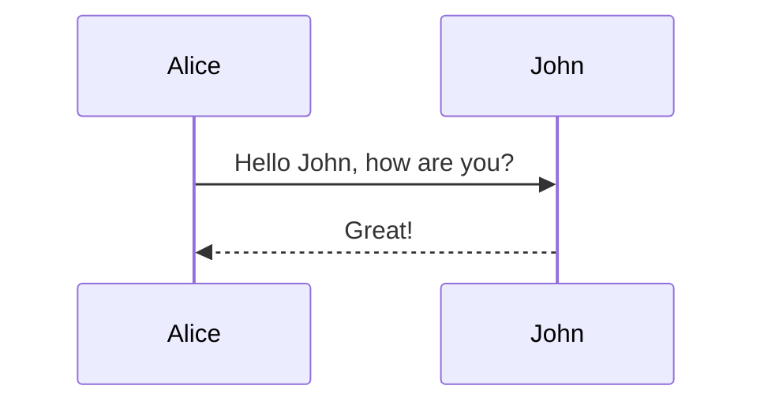
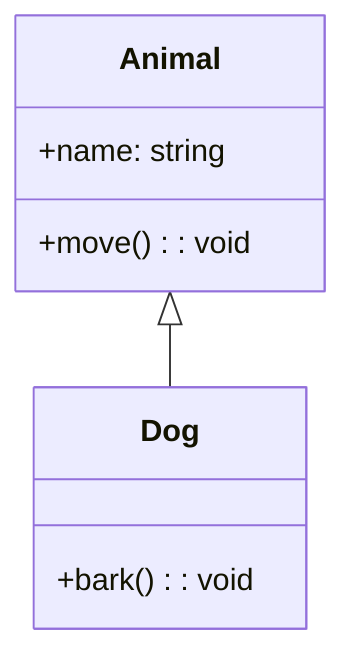
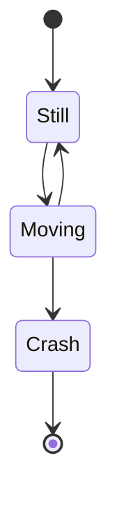
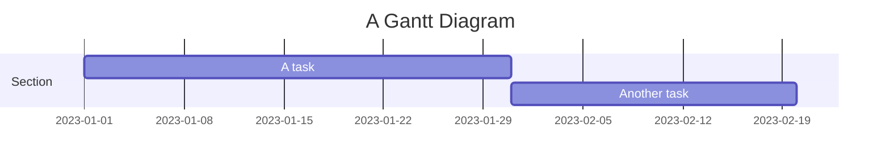
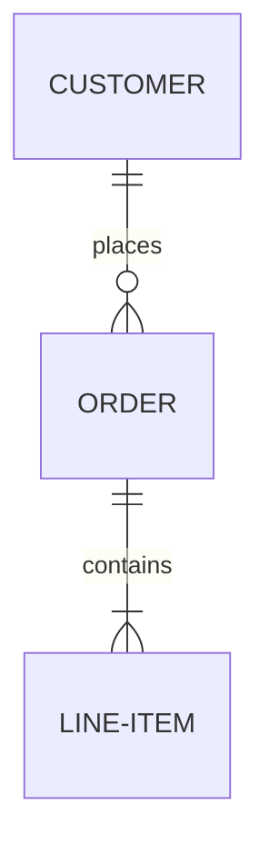

# Mermaid Test Page

This page contains test diagrams to verify Mermaid functionality.

## Simple Flowchart

## Simple Sequence Diagram

## Simple Class Diagram

## Simple State Diagram

## Simple Gantt Chart

## Simple ER Diagram

