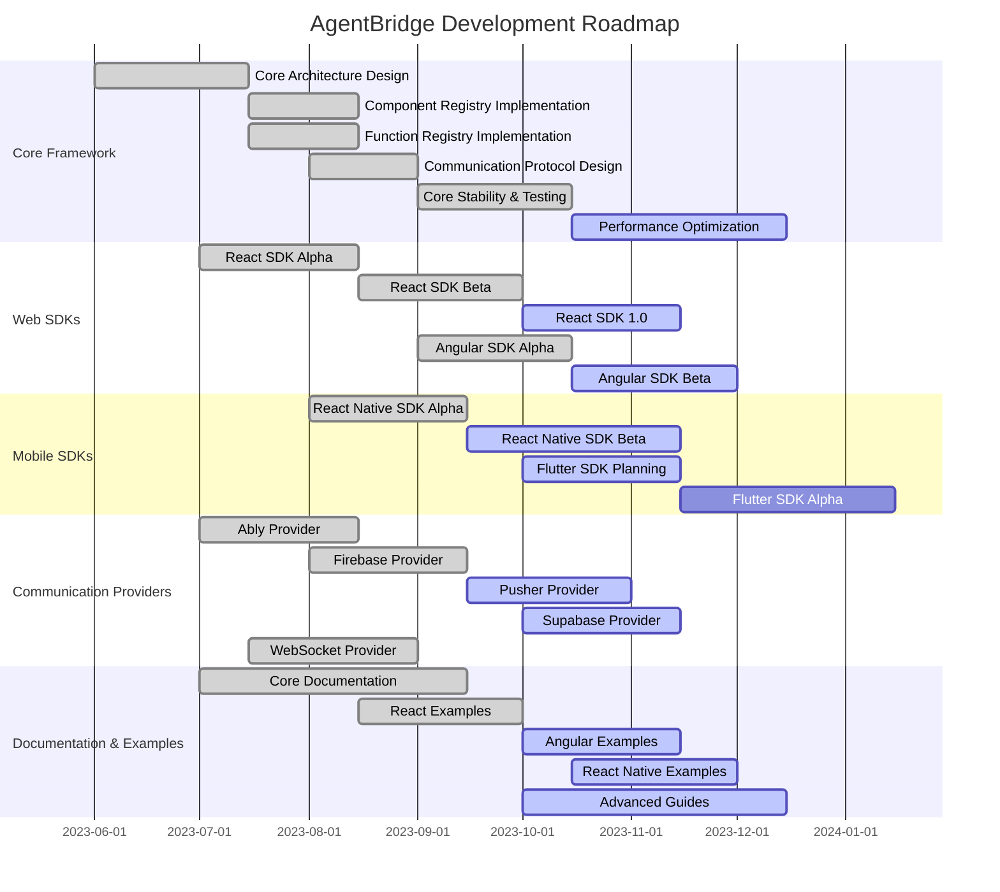

# Roadmap

This document outlines the development roadmap for AgentBridge.

## Current Milestones

The following Gantt chart shows the major development milestones for AgentBridge:

## Short-term Goals (Q4 2023)

- Complete React SDK 1.0 release
- Finalize Angular SDK Beta
- Release Pusher and Supabase providers
- Expand documentation and examples
- Improve TypeScript support

## Mid-term Goals (Q1-Q2 2024)

- Release Angular SDK 1.0
- Release React Native SDK 1.0
- Launch Flutter SDK Alpha
- Add authentication and access control features
- Develop additional communication providers

## Long-term Vision (2024 and beyond)

- Support for additional UI frameworks
- Advanced AI agent integration capabilities
- Server-side component for enterprise deployments
- Real-time collaboration features
- Performance optimizations for large-scale applications
- Community extension ecosystem

## Current Version (Alpha)

The current version of AgentBridge includes the following core functionality:

- ✅ Core architecture with dual-mode communication (Pub/Sub and Self-Hosted)
- ✅ Component and function registries with schema validation
- ✅ Basic React SDK with hooks, components, and HOCs
- ✅ Ably Pub/Sub provider implementation
- ✅ WebSocket communication for self-hosted mode
- ✅ Type-safe definitions with Zod schema validation

## Next Steps (Beta)

The following features are planned for the beta release:

### Communication Providers

- [ ] Firebase Pub/Sub provider
- [ ] Pusher Pub/Sub provider
- [ ] Supabase Pub/Sub provider
- [ ] WebSocket server implementation (for backend)
- [ ] Custom provider API for third-party integrations

### Framework Support

- [ ] Angular SDK
- [ ] Vue SDK
- [ ] React Native SDK
- [ ] Flutter SDK
- [ ] Framework adapter API for third-party framework support

### Component Model

- [ ] Standard component type definitions (button, input, form, etc.)
- [ ] Component relationship modeling (parent-child, dependencies)
- [ ] Automatic component discovery (reducing manual registration)
- [ ] Component state synchronization

### Security Enhancements

- [ ] Authentication integration (OAuth, JWT, API keys)
- [ ] Fine-grained access control for components and functions
- [ ] Rate limiting and throttling
- [ ] Audit logging

### Developer Experience

- [ ] CLI tool for scaffolding and setup
- [ ] Developer portal and documentation site
- [ ] Visual component explorer for debugging
- [ ] Testing utilities

### Agent Integration

- [ ] Agent-side SDKs for popular AI frameworks
- [ ] Capability discovery protocol
- [ ] OpenAPI-compatible function descriptions
- [ ] Custom agent protocols

## Release Timeline

| Phase | Target Date | Key Features |
|-------|------------|--------------|
| Alpha | Q2 2023 | Core architecture, React SDK, Ably provider |
| Beta | Q3 2023 | Multiple framework SDKs, all Pub/Sub providers, security improvements |
| Release Candidate | Q4 2023 | Agent SDKs, developer tools, full documentation |
| 1.0 | Q1 2024 | Production-ready with stability guarantees |

## Long-Term Vision

### Artificial Intelligence Integration

- [ ] AI-assisted component registration
- [ ] Automatic component description generation
- [ ] Intent-based component matching
- [ ] Context-aware function execution

### Enterprise Features

- [ ] Multi-tenant support
- [ ] Admin dashboard
- [ ] Analytics and monitoring
- [ ] Compliance and regulatory controls

### Ecosystem Expansion

- [ ] Plugin system for extensibility
- [ ] Component marketplace
- [ ] Pre-built integrations with popular services
- [ ] Community templates and examples

## Contributing

We welcome contributions to the AgentBridge project. Here are some areas where help is particularly needed:

1. **Additional Framework SDKs**: Help us build SDKs for more frameworks
2. **Pub/Sub Providers**: Implement additional providers
3. **Documentation**: Improve and expand documentation
4. **Examples**: Create example applications showcasing AgentBridge
5. **Testing**: Write tests and improve test coverage

See the [Contributing Guide](./contributing.md) for more information on how to get involved. 