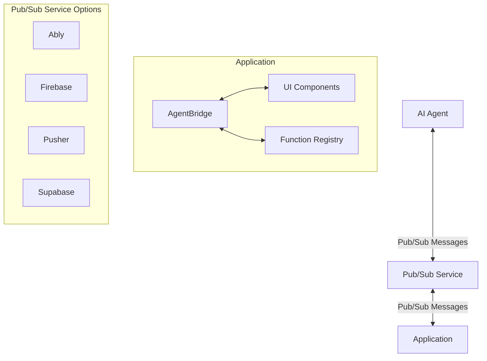
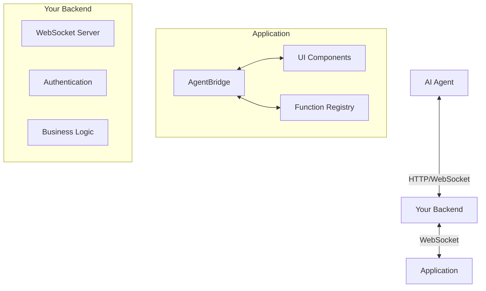

# Communication Modes

AgentBridge supports two primary communication modes to suit different application architectures:

1. **Pub/Sub Mode**: For frontend-only applications without dedicated backends
2. **Self-Hosted Mode**: For applications with dedicated backends

This guide will help you choose the right mode for your application and understand how to implement it.

## Pub/Sub Mode

Pub/Sub mode uses third-party real-time messaging services to facilitate communication between AI agents and your application. This mode is ideal for applications without a dedicated backend.



### How It Works

1. Your application initializes AgentBridge with a pub/sub provider (Ably, Firebase, etc.)
2. AgentBridge connects to the pub/sub service and publishes capabilities
3. AI agents connect to the same pub/sub service
4. AI agents discover capabilities and send commands
5. Your application executes commands and sends results

### Supported Providers

AgentBridge supports several pub/sub providers:

#### Ably

[Ably](https://ably.com/) is a real-time messaging service with a generous free tier.

```javascript
import { AblyProvider } from '@agentbridge/provider-ably';

const ablyProvider = new AblyProvider({
  apiKey: 'your-ably-api-key'
});

bridge.initialize(ablyProvider);
```

#### Firebase

[Firebase Realtime Database](https://firebase.google.com/docs/database) is Google's real-time solution with a strong ecosystem.

```javascript
import { FirebaseProvider } from '@agentbridge/provider-firebase';

const firebaseProvider = new FirebaseProvider({
  firebaseConfig: {
    // Your Firebase config
  }
});

bridge.initialize(firebaseProvider);
```

#### Pusher

[Pusher](https://pusher.com/) is a popular real-time messaging platform.

```javascript
import { PusherProvider } from '@agentbridge/provider-pusher';

const pusherProvider = new PusherProvider({
  key: 'your-pusher-key',
  cluster: 'eu'
});

bridge.initialize(pusherProvider);
```

#### Supabase

[Supabase Realtime](https://supabase.com/docs/guides/realtime) is an open-source Firebase alternative.

```javascript
import { SupabaseProvider } from '@agentbridge/provider-supabase';

const supabaseProvider = new SupabaseProvider({
  supabaseUrl: 'https://your-project.supabase.co',
  supabaseKey: 'your-supabase-key'
});

bridge.initialize(supabaseProvider);
```

### Custom Providers

You can implement custom pub/sub providers by implementing the `CommunicationProvider` interface. See the [Custom Pub/Sub Providers](../core/pubsub-config.md#custom-provider) documentation for more details.

### Pros and Cons

#### Pros
- Simple to set up and maintain
- No backend required
- Multiple provider options
- Low operational overhead

#### Cons
- Limited control over communication
- Potential security concerns with client-side keys
- Third-party dependencies
- Possible usage limits or costs

## Self-Hosted Mode

Self-hosted mode uses WebSockets with your own backend server, which acts as a mediator between AI agents and your application.



### How It Works

1. Your application initializes AgentBridge with the WebSocket provider
2. AgentBridge connects to your backend server via WebSockets
3. AI agents connect to your backend server (via HTTP or WebSockets)
4. Your backend server mediates communication between AI agents and applications
5. Your backend can implement additional logic, authentication, etc.

### Implementation

#### Frontend Configuration

```javascript
import { WebSocketProvider } from '@agentbridge/communication-websocket';

const wsProvider = new WebSocketProvider({
  url: 'wss://your-server.com/agent-bridge',
  headers: {
    'Authorization': `Bearer ${token}`
  }
});

bridge.initialize(wsProvider);
```

#### Backend Implementation

You'll need to implement a WebSocket server on your backend. Here's a basic example using Node.js:

```javascript
const WebSocket = require('ws');
const server = new WebSocket.Server({ port: 8080 });

server.on('connection', (ws, req) => {
  // Handle authentication
  const token = req.headers['authorization']?.split(' ')[1];
  if (!validateToken(token)) {
    ws.close(4001, 'Unauthorized');
    return;
  }
  
  // Handle messages
  ws.on('message', (message) => {
    const parsedMessage = JSON.parse(message);
    handleMessage(parsedMessage, ws);
  });
});
```

For detailed server implementation examples, see the [WebSocket Configuration](../core/websocket-config.md) documentation.

### Pros and Cons

#### Pros
- Complete control over communication
- Enhanced security options
- Integration with existing backend systems
- No third-party dependencies
- No usage limits or costs

#### Cons
- More complex to set up and maintain
- Requires backend development
- Operational overhead
- Scalability considerations

## Choosing the Right Mode

Consider the following factors when choosing a communication mode:

### Choose Pub/Sub Mode If:

- You don't have a backend or don't want to modify it
- You need a quick and simple setup
- You're building a prototype or MVP
- You're comfortable with third-party services
- Your application doesn't handle highly sensitive data

### Choose Self-Hosted Mode If:

- You already have a backend
- You need complete control over communication
- You handle sensitive data with specific security requirements
- You want to avoid third-party dependencies
- You need to integrate with existing backend systems
- You're concerned about third-party service limits or costs

## Configuration

### Pub/Sub Configuration

See the [Pub/Sub Configuration](../core/pubsub-config.md) documentation for detailed configuration options.

### WebSocket Configuration

See the [WebSocket Configuration](../core/websocket-config.md) documentation for detailed configuration options.

## Security Considerations

Both communication modes require careful security implementation:

- **Authentication**: Implement proper authentication for both AI agents and users
- **Authorization**: Control what actions AI agents can perform
- **Data Validation**: Validate all data exchanged with AI agents
- **Transport Security**: Use secure connections (HTTPS/WSS)

For detailed security guidance, see the [Security Best Practices](../advanced/security.md) documentation.

## Next Steps

- [Installation Guide](installation.md): Install AgentBridge and its dependencies
- [Quick Start](quick-start.md): Build your first AI-enabled application
- [Core Concepts](../core/overview.md): Learn about the core concepts of AgentBridge 